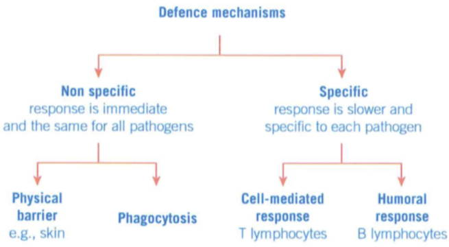
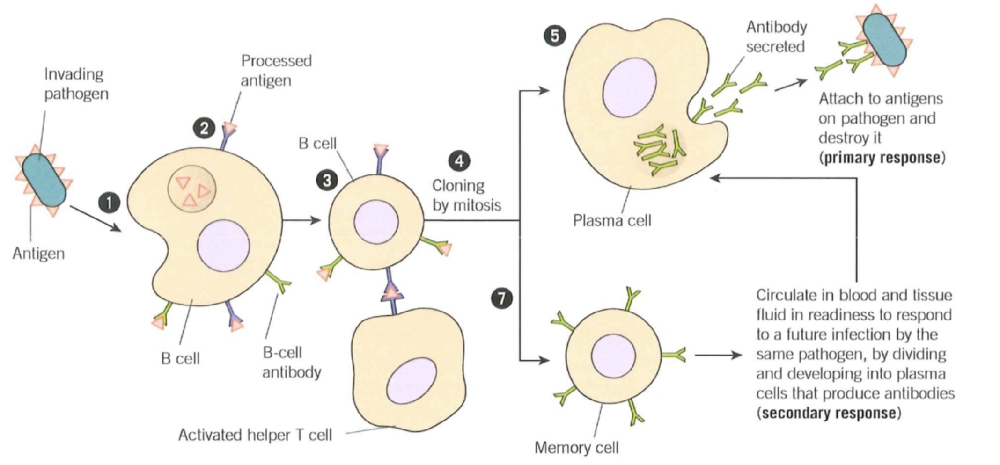
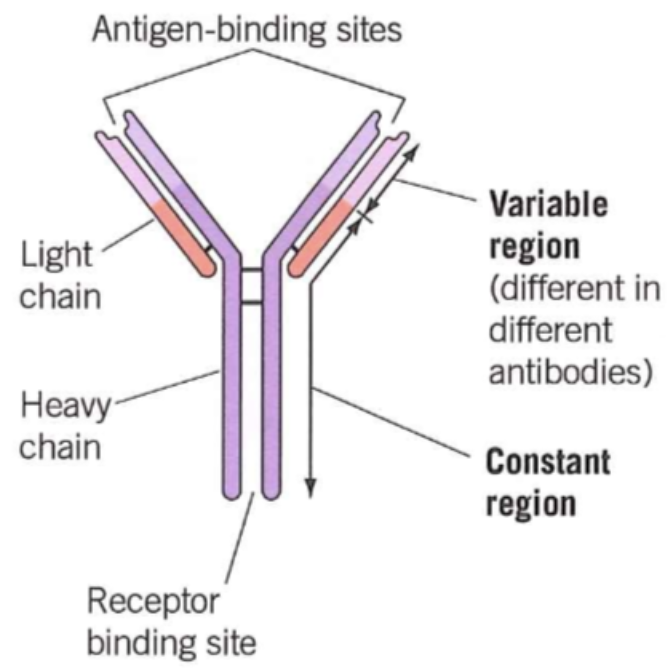
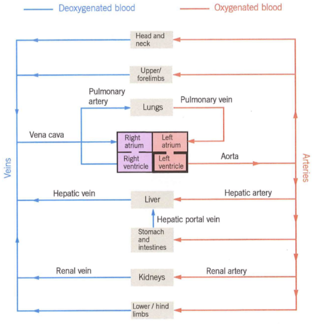

# Unit 2: Biological systems and disease

## Chapter 11 Causes of disease

### 11.1 Pathogens
- **Pathogens**: any microorganisms that causes disease
- **Infection**: pathogen gets into/colonises tissue
- **Transmission**: transfer of a pathogen from one individual to another

#### Microorganisms that are pathogens
- Bacteria
- Viruses
- Fungi
- Protoctists

#### Microorganisms enter by
- gas-exchange system
- digestive system
- reproductive system

#### Natural defences
- mucus layer
- enzyme
- stomach acid

#### Cause disease
- damaging host tissue
- producing toxins

How quickly causes damage = How rapidly pathogens divided

---

### 11.2 Data and disease
#### Step of epidemiological study
1. local observation
2. hypothesis
3. compare local data with national data
4. compare data globally

#### Can we say “A causes B”?
No, just correlated but no evidence to prove A causes B.

**Causation ≠ Correlation**

#### Looking critically at data
- Right factor measured? Correct questions asked?
- Reliable data-gathering methods? Appropriate apparatus?
- Data collectors have vested interest?
- Study repeated with consistent results/conclusions?
- Unanswered questions remaining?

---

### 11.3 Lifestyle and health
- **Risk**: measure of the probability that damage to health will occur as a result of a given hazard

#### Risk concept has two elements
- probability of hazardous event occurring
- consequences of that hazardous event

#### Analyzing smokers may be 15 times more likely to develop lung cancer than non-smokers
1. Time period of occurrence?
2. Daily cigarettes affect the figure?
3. Stress, alcohol, occupation, gender, pollution influence?
4. Varies by location (country/city/countryside)?

#### Factors of cancer
1. Smoking
2. Diet
3. Obesity
4. Physical activity
5. Sunlight

#### Factors of CHD
1. Smoking
2. High blood pressure
3. Blood cholesterol
4. Obesity
5. Diet
6. Physical activity

#### Reducing the risk of cancer and CHD
- not taking up smoking
- avoiding overweight
- reducing salt
- reducing intake of cholesterol and saturated fats
- taking regular aerobic exercise
- keeping alcohol consumption within safe limits
- increasing fibre and antioxidants in the diet

---

## Chapter 12 Digestion and absorption

### 12.1 Enzymes and digestion
#### Human digestive system
- oesophagus
- stomach
- duodenum
- ileum
- colon
- rectum

#### Digestion
Digestion: is the process in which large molecules are hydrolysed by enzymes to produce smaller molecules.

#### Two stages
1. **Physical breakdown**
   - the breakdown of food into smaller pieces

2. **Chemical digestion**
   - hydrolyse large insoluble molecules into small soluble molecules

#### Major parts

| Structure | Function |
| --- | --- |
| Mouth and salivary glands | - teeth break down food into smaller pieces - saliva - amylase hydrolyses starch into maltose |
| Stomach | - protease - HCl provides suitable pH and destroys pathogens |
| Liver | - bile salts emulsify fat and neutralise HCl, providing optimum pH |
| Pancreas | - amylase, protease and lipase |
| Small intestine: duodenum | - acidic stomach contents are neutralised by bile - complete chemical digestion |
| Small intestine: ileum | - food further digested, and absorbed into the blood via villi |

---

### 12.2 Digestion
#### Digestion process of carbohydrates
1. Saliva from salivary glands mixes with food
2. Amylase: hydrolyses starch to maltose; mineral salts maintain neutral pH
3. Food enters stomach; acid denatures amylase, stops starch hydrolysis
4. Food enters small intestine, mixes with pancreatic juice
5. Amylase: starch hydrolysis to maltose; alkaline salts maintain neutral pH
6. Intestinal muscles move food; ileum produces maltase, hydrolyses maltose to α‑glucose

#### Digestion process of lipids
1. Lipids hydrolysed by lipases
2. Pancreatic lipases break ester bonds in triglycerides
3. Monoglyceride: glycerol + one fatty acid
4. Bile salts split lipids into micelles
5. Emulsification increases lipid surface area

#### Digestion process of proteins
1. Proteins hydrolysed by peptidases
2. Endopeptidases: hydrolyse internal peptide bonds
3. Exopeptidases: hydrolyse terminal peptide bonds
4. Dipeptidases: membrane‑bound, hydrolyse dipeptides

---

### 12.3 Absorption of the products of digestion
#### Structure of ileum
1. Increase surface area
2. Thin walled → short diffusion distance
3. Muscular movement maintains diffusion gradient
4. Rich blood vessels → maintain diffusion gradient
5. The epithelial cells lining the villi possess microvilli, increasing the surface area

#### Absorption of amino acids and monosaccharides
1. Protein digestion → amino acids; Carbohydrate digestion → glucose, fructose, galactose
2. Absorption via facilitated diffusion and co-transport

**Steps:**
1. Sodium ions active transport (via sodium-potassium pump)
2. Maintains higher Na⁺ concentration
3. Na⁺ diffuse into cells down gradient; carry amino acids/glucose into cells
4. Glucose/amino acids enter blood plasma via facilitated diffusion

- Na⁺ move down concentration gradient; glucose/amino acids move against gradient
- Na⁺ gradient powers glucose/amino acid uptake (no ATP directly)
- Indirect active transport (co-transport)

#### Absorption of triglycerides
1. Monoglycerides & fatty acids associate with bile salts → form **micelles**
2. Micelles contact villus epithelial cells → break down, release lipids
3. Non‑polar lipids diffuse easily into epithelial cells
4. Monoglycerides & fatty acids → transported to endoplasmic reticulum → recombined into triglycerides
5. Triglycerides associate with cholesterol & lipoproteins → form chylomicrons
6. Chylomicrons leave epithelial cells via **exocytosis**
7. Enter **lacteals** (lymphatic capillaries in villi centre)
8. Pass through lymph vessels into **blood system**
9. Triglycerides hydrolysed by enzyme
10. Products diffuse into **body cells**

## Chapter 14 Mammalian blood - defensive mechanisms
### 14.1 Cell recognition and the cells of the immune system

Mammalian immune defence mechanisms are divided into two main categories, with specific responses mediated by **lymphocytes** (a type of white blood cell) in two forms:
- **Non-specific response**: Immediate, identical for all pathogens (e.g., physical barriers like skin, phagocytosis)
- **Specific response**: Slower, tailored to individual pathogens
  - Cell-mediated response (involves T lymphocytes)
  - Humoral response (involves B lymphocytes)

#### Key recognition molecules
Protein molecules enable the immune system to identify:
- Pathogens
- Non-self material
- Toxins produced by pathogens
- Abnormal body cells (e.g., cancer cells)

### 14.2 Phagocytosis
Phagocytosis is a core non-specific immune response that destroys pathogens via phagocytic white blood cells.

#### Phagocytosis process
1. Chemicals released by pathogens/damaged/abnormal cells **attract phagocytes** (movement along a concentration gradient).
2. Phagocytes bind to pathogen surface antigens via cell-surface receptors, then **engulf the pathogen** to form a **phagosome**.
3. Lysosomes within the phagocyte fuse with the phagosome, releasing **lysozymes** that hydrolyse the pathogen’s cell wall and destroy it.
4. Hydrolysis products of the pathogen are absorbed by the phagocyte; waste debris is eliminated.

#### Core definitions
##### Antigen
Specific cell-surface molecules (usually **proteins** on cell membranes/walls) that act as cell identifiers. The immune system distinguishes **self** and **non-self** cells by recognizing unique antigen patterns.

##### Lymphocytes
Specialized white blood cells for specific immunity, maturing in different sites:
- **B lymphocytes (B cells)**: Mature in the **bone marrow**; mediate **humoral immunity** (antibody-based).
- **T lymphocytes (T cells)**: Mature in the **thymus gland**; mediate **cell-mediated immunity** (cell-to-cell interaction).

### 14.3 Cell-mediated immune response
This response targets **pathogen-infected body cells**, abnormal cells (e.g., cancer) and transplanted cells—all classified as **antigen-presenting cells** (display foreign antigens on their surface).

#### Antigen-presenting cells (APCs)
Cells that display foreign antigens on their surface include:
- Phagocytes (after engulfing/hydrolysing pathogens)
- Infected body cells
- Transplanted cells (from the same species with different antigens)
- Cancer cells (abnormal surface antigens)

#### Cell-mediated response steps

1. Pathogens invade body cells or are engulfed by phagocytes.
2. Phagocytes present pathogen antigens on their cell-surface membrane.
3. Receptors on a **specific helper T cell (TH cell)** bind to these foreign antigens, activating the helper T cell.
4. The activated helper T cell divides rapidly by **mitosis** to form a clone of T cells.

#### Functions of cloned T cells
1. Develop into **memory T cells**: Circulate in blood/tissue fluid, ready to respond rapidly to future infection by the same pathogen.
2. Stimulate B cell division and activation (links cell-mediated and humoral immunity).
3. Enhance phagocytosis (stimulate phagocytic activity).
4. Activate **cytotoxic T cells (Tc cells)** to kill infected/abnormal cells.

#### Cytotoxic T cell action
Cytotoxic T cells kill abnormal/pathogen-infected cells by producing **perforin**—a protein that forms holes in the target cell’s membrane. This makes the membrane fully permeable, causing the cell to lyse and die.
- **Key target**: Virally infected cells (destroying them stops viral replication and further spread of infection).

### 14.4B lymphocytes, humoral immunity, and antibodies
**Humoral immunity** is antibody-mediated immunity that acts in the **blood plasma and tissue fluid** (the "humors"), targeting free pathogens (not infected cells). B cells are the primary mediators, with each B cell producing antibodies specific to one antigen.

#### B cell differentiation
After activation, each B cell clone develops into two specialized cell types:
1. **Plasma cells**: Secrete large quantities of **antibodies** into blood plasma; survive only a few days. Provide the **immediate immune defence** by binding to and destroying antigens.
2. **Memory B cells**: Long-lived cells that mediate the **secondary immune response**.

#### Humoral immune response steps

1. B cells take up surface antigens of invading pathogens via their cell-surface receptors.
2. B cells process the antigens and **present them on their own surface**.
3. Activated helper T cells bind to the processed antigens on B cells, fully activating the B cells.
4. Activated B cells divide by mitosis to form a clone of **plasma cells** (and a small number of memory B cells).
5. Cloned plasma cells produce and secrete **antigen-specific antibodies** that match the pathogen’s surface antigens.
6. Antibodies bind to pathogen antigens (**antigen-antibody complex**) and destroy the pathogen.
7. Memory B cells persist in the body; on re-encountering the same antigen, they rapidly divide into plasma cells for the secondary immune response.

#### Antibody structure

Antibodies are **globular proteins** synthesised by B cells, with a highly specific structure:
- Composed of **four polypeptide chains**: 2 heavy (long) chains and 2 light (short) chains, held together by **disulfide bridges**.
- **Variable region**: Unique to each antibody; forms the **antigen-binding site** (matches the shape of a specific antigen).
- **Constant region**: Identical for all antibodies of the same type; includes a receptor-binding site for interaction with immune cells (e.g., phagocytes).

#### Antibody action (pathogen destruction)
Antibodies do not directly kill pathogens—they mark them for destruction by two key mechanisms:
1. **Agglutination**: Antibodies bind to multiple bacterial cells, causing them to clump together. Clumped bacteria are easier for phagocytes to locate and engulf.
2. **Opsonization**: Antibodies act as **markers** on pathogen surfaces, stimulating phagocytes to recognize and engulf the attached pathogens.

### 14.5 Vaccination
**Immunity** is the ability of an organism to resist infection by disease-causing microorganisms (pathogens). Vaccination is the basis of **artificial active immunity**, inducing a specific immune response without causing the full disease.

#### Types of immunity
Immunity is classified by **how it is acquired** and **whether the body produces its own antibodies**:

| Feature                | Active Immunity                          | Passive Immunity                          |
|------------------------|------------------------------------------|-------------------------------------------|
| Antibody production    | Produced by the body itself              | Not produced by the body (external source)|
| Time to develop        | 1-2 weeks (delayed)                      | Immediate                                 |
| Memory cells           | Present (long-lasting immunity)          | Absent (temporary immunity)               |
| **Induced by:**       |                |
| Natural induction  | Exposure to a live pathogen (infection)  | Antibodies from another organism (e.g., placenta/breast milk for fetuses/infants) |
| Artificial induction| Vaccination (inactivated/attenuated pathogen/antigen) | Injected manufactured antibodies (e.g., snake bite anti-venom, monoclonal antibodies) |

##### Key details
- **Passive immunity**: No contact with pathogen/antigen required; immunity fades as external antibodies are broken down (no replacement).
- **Active immunity**: Pathogen/antigen contact required; immunity is long-lasting due to memory cells.
  - **Natural active**: From natural infection (e.g., recovering from a cold).
  - **Artificial active**: From vaccination (core of immunization programmes).

#### Features of a successful vaccination programme
To be effective, a vaccination programme must meet the following criteria:
1. Affordable and sufficient vaccine for the **most vulnerable populations** (e.g., infants, the elderly).
2. Few or no side effects (to encourage uptake).
3. Reliable vaccine production, storage and transport (maintain vaccine efficacy).
4. Proper and timely vaccine administration (correct dosage/schedule).
5. Vaccinate a high enough proportion of the population to achieve **herd immunity**.

#### Herd immunity
**Herd immunity** occurs when a **large proportion of the population is vaccinated**, creating an indirect barrier to pathogen spread.
- **Mechanism**: High vaccination rates mean susceptible (unvaccinated) individuals rarely come into contact with infected people, as the pathogen cannot spread easily through the immune population.
- **Essential for**: Individuals who cannot be vaccinated safely (e.g., babies with immature immune systems, people with compromised immune systems, those with medical contraindications).
- **Optimization**: Achieved best by **mass vaccination at the same time**, temporarily reducing disease cases and interrupting pathogen transmission (the required vaccination percentage varies by disease).

#### Why vaccination may not eliminate a disease
Despite effective vaccines, some diseases cannot be fully eliminated due to these key factors:
1. Vaccination fails to induce immunity in some individuals (primary vaccine failure).
2. Some people develop the disease **immediately after vaccination** (before immunity is fully established) and can transmit the pathogen to others.
3. Pathogens **mutate frequently**, causing **antigenic variability** (changes to surface antigens).
4. Antigenic variability (e.g., influenza virus, HIV) leads to short-lived immunity, resulting in repeated infections and the need for updated vaccines.
5. Too many pathogen varieties/strains make a **universally effective vaccine** nearly impossible (e.g., the common cold, which has hundreds of viral strains).
6. Pathogens can **hide from the immune system** (e.g., inside body cells or in immune-privileged sites).
7. Individuals object to vaccination for **religious, ethical or medical reasons** (low uptake reduces herd immunity).

#### Antigen Variability
**Antigen variability** is the change in the structure/shape of pathogen surface antigens due to **random genetic mutations**.
- Vaccines and immunity are far easier to develop for pathogens with **low/no antigen variability** (e.g., smallpox, polio) than those with high variability (e.g., flu, COVID-19).
- Mutated antigens are unrecognizable by existing memory cells, meaning the immune system mounts a slow **primary response** instead of a rapid secondary response.

#### Secondary Immune Response
The secondary immune response is the **rapid, amplified immune reaction** that occurs when the body re-encounters an antigen it has previously been exposed to (via infection or vaccination).
1. During the **primary immune response**, plasma cells secrete short-lived antibodies and produce long-lived **memory B/T cells** that circulate in the bloodstream.
2. On re-exposure to the same antigen, memory cells rapidly divide into new **plasma cells** (and more memory cells) without the need for helper T cell activation (faster pathway).
3. Plasma cells in the secondary response secrete antibodies **much faster and in larger quantities** than in the primary response, destroying the pathogen before symptoms develop.
4. New memory cells are produced to maintain **long-term immunity** against future reinfections.

#### The ethics of using vaccines
Vaccine development, testing and implementation raise important ethical questions that balance individual risk, public health and moral values:
1. Vaccine production/development often involves **animal testing**—is this ethically acceptable?
2. Vaccines may have rare side effects that cause long-term harm—how to balance this small individual risk against the greater harm of widespread disease?
3. Who should be **vaccine test subjects**? How to conduct trials ethically, and how much risk should individuals accept for public health benefit?
4. Is it ethical to test new vaccines (with unknown risks) **only in countries where the disease is common** (on the grounds that the population has the most to gain)?
5. Is **compulsory vaccination** justified for public health, especially during epidemics? On what ethical grounds can individuals opt out?
6. Is it worth continuing **costly vaccination programmes** for near-eradicated diseases, even if this reduces funding for other medical treatments?
7. How to balance **individual vaccine risks** (e.g., rare side effects) against the **population-wide benefits** of disease control and eradication?

## Chapter 15 Mammalian blood - the circulatory system

### 15.1 Circulatory system of a mammal
#### Mass transport
Two factors:
1. SA:V
2. How active it is?

#### Features of transport systems
1. efficient internal transport
2. transport medium
3. mass transport
4. closed tubular vessel network
5. pressure difference
   - Animals: muscular contraction
   - Plants: passive physical processes
6. maintain unidirectional flow
7. control flow to match needs of different body parts

#### Double circulatory system
- Blood passes **twice through the heart** per full body circuit
- Blood pressure reduces after passing through lungs
- Low pressure would slow circulation to body tissues
- Blood returns to heart to **boost pressure**
- Fast delivery of substances
- Suits mammals: high body temperature & **high metabolic rate**

#### Closed & Double characteristics
- **Closed**: Blood is contained in blood vessels; Always in heart, arteries, veins or capillaries
- **Double**: Blood passes through the heart twice, in one complete circuit
  1 circuit = 2 circulations:
  1) **Pulmonary circulation**: Circulation through the lungs and heart
  2) **Systemic circulation**: Circulation through other parts of the body and heart except the lungs

---

### 15.2 Blood vessels and their functions
#### Structure of blood vessels
- Arteries
- Arterioles: small arteries
- Capillaries: tiny vessels
- Veins

#### Common basic layers of arteries, arterioles, veins
1. Tough outer layer – resists pressure changes
2. Muscle layer – controls blood flow
3. Elastic layer – maintains blood pressure
4. Endothelium – reduces friction; thin for diffusion
5. Lumen – central cavity

#### Artery structure – function adaptations
- **Function**: transport blood **rapidly & at high pressure** from heart to tissues
- Thick muscle layer: control blood volume flow
- Thick elastic layer: maintains high pressure & smooths pressure surges
- Thick wall: resists bursting
- No valves: prevents back flow

#### Arteriole structure – function adaptations
- **Function**: **control blood flow**
- Thicker muscle layer: controls blood flow into capillaries
- Thinner elastic layer: lower blood pressure
- Thinner wall + larger lumen: adapted to lower pressure

#### Vein structure – function adaptations
- **Function**: transport blood **slowly & under low pressure**
- Thin muscle layer: no need to control blood flow
- Thin elastic layer: no stretch/recoil
- Thin wall: no bursting risk; easy to flatten
- Valves present: prevent back flow
- Muscle contraction compresses veins → pushes blood toward heart

#### Capillary structure – function adaptations
- **Function**: **exchange materials**
- Blood flow slow: more time for exchange
- Wall: short diffusion distance → rapid diffusion
- Numerous & highly branched: large **surface area**
- Narrow diameter: close to capillaries
- Very narrow lumen: reduce diffusion distance for O₂
- Gaps between endothelial cells: allow WBCs to escape for immune response

#### Formation of tissue fluid
- Blood flow creates **hydrostatic pressure** at arterial end of capillaries
- Pressure forces fluid out of blood plasma
- Opposed by:
  - Tissue fluid hydrostatic pressure
  - Blood lower water potential (plasma proteins) pulling water back
- Net outward pressure → **ultrafiltration**
- Only small molecules forced out

#### Return of tissue fluid to circulatory system
- Most fluid returns **directly to blood plasma**
- Fluid loss → capillary hydrostatic pressure **lower at venous end**
- Higher external tissue fluid pressure forces fluid back in
- Blood plasma has **lower water potential**
- Water moves back **by osmosis**

*Not all tissue fluid returns to capillaries; the rest goes through the lymphatic system.*

#### Lymph movement (no heart pump)
- hydrostatic pressure of tissue fluid
- muscle contraction squeezing lymph vessels, valves ensuring one‑way flow

---

### 15.3 The structure of the heart
The human heart is two separate side-by-side pumps:
- Left pump: oxygenated blood (from lungs)
- Right pump: deoxygenated blood (from body)

#### Heart chambers (2 per pump)
1. **Atrium**: Thin-walled, elastic; stretches to collect blood, pumps blood a short distance to ventricle → thin muscular wall.
2. **Ventricle**: Much thicker muscular wall; pumps blood to lungs/ rest of the body (longer distance).

#### Why two separate pumps?
- Blood passes through tiny lung capillaries → large pressure drop → slow body blood flow if sent straight to body.
- Mammal adaptation: Blood returns to heart to **increase pressure** before body distribution.
- Right ventricle: Thinner muscular wall; pumps blood to lungs
- Left ventricle: Thick muscular wall; generates sufficient pressure to pump blood
- Heart: Two separate pumps, no blood mixing after birth
- Cardiac contraction & volume: Same blood volume pumped per unit time from each ventricle; both atria contract together, then both ventricles contract together

#### Vessels connected to four chambers
- Aorta: left ventricle → oxygenated blood to body (except lungs).
- Vena cava: right atrium → deoxygenated blood from body tissues.
- Pulmonary artery: right ventricle → deoxygenated blood to lungs (O₂ replenished, CO₂ removed); carries deoxygenated blood (unusual for artery).
- Pulmonary vein: left atrium → oxygenated blood from lungs; carries oxygenated blood (unusual for vein).

#### Heart muscle oxygen supply
- Oxygenated blood in left heart does not supply heart muscle.
- Heart muscle supplied by coronary arteries (branch from aorta).
- Coronary artery blockage → myocardial infarction: heart muscle area deprived of oxygen and dies.

---

### 15.4 The cardiac cycle
#### Three types of valves
1. Atrioventricular valve
2. Semi-lunar valve
3. Pocket valve (in vein)

*The valves only open one way-whether they're open or closed depends on the relative pressure of the heart chambers.*

*Usually measure the pressure on the left side of heart ---Left atrium, left ventricle, aorta (Due to higher pressure and larger diff in pressure compared to right side).*

#### Three stages of the cardiac cycle
1. **Atrial systole** - Ventricles relax, atria contract
   - The ventricles are relaxed. The atria contract, decreasing the volume of the chambers and increasing the pressure inside the chambers.
   - This pushes the blood into the ventricles. There's a slight increase in ventricular pressure and chamber volume as the ventricles receive the ejected blood from the contracting atria.

2. **Ventricular systole** - Ventricles contract, atria relax
   - The atria relax. The ventricles contract (decreasing their volume), increasing their pressure.
   - The pressure becomes higher in the ventricles than the atria, which forces the AV valves shut to prevent back-flow.
   - The pressure in the ventricles is also higher than in the aorta and pulmonary artery, which forces open the SL valves and blood is forced out into these arteries.

3. **Diastole** - Ventricles relax, atria relax
   - The ventricles and the atria both relax. The higher pressure in the pulmonary artery and aorta closes the SL valves to prevent back-flow into the ventricles.
   - Blood returns to the heart and the atria fill again due to the higher pressure in the vena cava and pulmonary vein. In turn this starts to increase the pressure of the atria.
   - As the ventricles continue to relax, their pressure falls below the pressure of the atria and so the AV valves open.
   - This allows blood to flow passively (without being pushed by atrial contraction) into the ventricles from the atria. The atria contract, and the whole process begins again.

#### Key definitions
- Systole = contraction
- Diastole = relaxation
- Blood flows from higher to lower pressure
  - Contraction increases the pressure
  - Valves open/close according to pressure gradients
    - AV valves open: Pa>Pv; closed: Pa<Pv
    - semilunar valves open: Pv>Ppa; closed: Pv<Ppa

#### Cardiac output
- **Definition**: Volume of blood pumped by **one ventricle** in **one minute**
- **Unit**: dm³.min⁻¹
- **Dependent factors**:
  1. Heart rate: The rate of heart beats
  2. Stroke volume: Volume of blood pumped out per beat
- **Formula**: **Cardiac output = heart rate × stroke volume**

#### Control of the cardiac cycle
- Cardiac muscle is **myogenic**
- Key structure: **Sinoatrial node (SAN)** (in right atrium) → acts as the **pacemaker**
- **Coordination sequence**:
  1. Electrical activity wave spreads from SAN across both atria → **atrial contraction**.
  2. **Atrioventricular septum** blocks the wave from reaching ventricles directly.
  3. Electrical wave passes through the **atrioventricular node (AVN)**.
  4. AVN delays briefly, then transmits the wave to ventricles via **bundle of His**.
  5. Bundle of His conducts the wave through the septum to the **base of ventricles**, then branches into smaller fibres.
  6. Electrical wave is released from fibres → ventricles contract **simultaneously, from apex upwards**.

#### Pressure and volume changes of the heart
[INSERT IMAGE]
[INSERT IMAGE]

- Aortic pressure rises when muscle in the wall of the ventricles contracts and blood is forced into the aorta; it then gradually falls but never below around 12 kPa (due to aortic wall elasticity/recoil).
- Ventricular pressure is low at first, gradually increases as ventricles fill with blood; rises dramatically when ventricular walls contract (AV valves close), falls as ventricles empty and relax.
- Atrial pressure is always relatively low (thin atrial walls); highest when contracting, drops when relaxing/filling.
- Ventricular volume rises as atria contract and ventricles fill; drops suddenly when semilunar valve opens (blood forced into aorta); increases again as AV valve opens.
- Atrial volume rises as blood returns to the heart; drops when atria contract and blood moves to ventricles.

#### Pressure reference

- Systolic pressure = the maximum blood pressure in the arteries
- Diastolic pressure = the minimum blood pressure in the arteries
- Human blood pressure is usually between 80-120mmHg

---

### 15.5 Heart disease
#### Atheroma
- **Definition**: A fatty deposit forming within the **artery wall**
- **Development**: Starts as **fatty streaks** (accumulated white blood cells that take up LDLs) → enlarge into irregular **atheromatous plaques**
- **Plaque composition**: Mainly cholesterol, fibres, dead muscle cells
- **Location**: Most common in **larger arteries**
- **Effect**: Bulges into artery lumen → lumen narrows → **reduced blood flow**
- **Risks**: Increases chance of two dangerous conditions: **thrombosis** and **aneurysm**

#### Thrombosis
- **Cause**: Atheroma breaks through blood vessel **endothelium** → creates rough surface that disrupts smooth blood flow
- **Formation**: Rough surface leads to blood clot (**thrombus**) formation → condition is thrombosis
- **Effects**:
  1. Thrombus blocks the blood vessel → reduces/stops blood supply to tissues downstream
  2. Deprived tissues die due to lack of oxygen, glucose and other nutrients
  3. Thrombus may dislodge, travel and block another artery
- **Example**: Thrombus can form in a **coronary artery**

#### Aneurysm
- **Cause**: Atheromas (that cause thrombosis) **weaken artery walls**
- **Formation**: Weakened artery wall areas swell into a **balloon-like, blood-filled structure (aneurysm)**
- **Effect**: Aneurysms often burst → **haemorrhage** → loss of blood to the body region the artery supplies
- **Key example**: Brain aneurysm = **cerebrovascular accident (CVA) / stroke**

#### Myocardial infarction
- **Common name**: **Heart attack**
- **Definition**: Reduced oxygen supply to the heart muscle (**myocardium**)
- **Cause**: **Blockage in the coronary arteries** (almost always linked to atheroma, many cases involve coronary thrombosis)
- **Severity depends on blockage location**:
  - Near coronary artery-aorta junction: Complete blood supply cut-off → heart stops beating
  - Further along coronary artery: Milder symptoms

#### Risk factors associated with CHD
##### Smoking
###### Carbon monoxide (CO) effects
- Reacts **easily and irreversibly** with red blood cell haemoglobin → forms **carboxyhaemoglobin**
- **Direct effect**: Reduces the **oxygen-carrying capacity** of blood
- **Secondary effects**:
  1. Heart must work harder to supply adequate oxygen to tissues → raised blood pressure → increased risk of **CHD** and **strokes**
  2. Reduced oxygen transport may fail to meet heart muscle’s oxygen demand during exercise → causes **chest pain (angina)**; severe cases lead to **myocardial infarction**

###### Nicotine effects
- Stimulates adrenaline production → **increased heart rate + raised blood pressure** → higher risk of **CHD** and **strokes**
- Makes blood platelets more sticky → elevated risk of **thrombosis** → further increases chances of **strokes** or **myocardial infarction**

##### High blood pressure
- Higher arterial pressure → heart must work harder to pump blood into arteries → **increased risk of heart failure**
- Higher arterial pressure → arteries more likely to form **aneurysms and burst** → cause haemorrhage
- Arteries respond to high pressure: walls **thicken and may harden** → restrict blood flow

##### Blood cholesterol
###### High-density lipoproteins (HDLs)
- **Function**: Remove cholesterol from tissues, transport to liver for excretion
- **Effect**: Protect arteries against heart disease

###### Low-density lipoproteins (LDLs)
- **Function**: Transport cholesterol from liver to tissues (including artery walls)
- **Effect**: Infiltrate artery walls → lead to atheroma development → increase heart disease risk

##### Diet
- High salt levels → raise blood pressure
- High saturated fat levels → increase LDL levels → raise blood cholesterol concentration
- Antioxidant-rich foods (e.g., vitamin C) → reduce heart disease risk
- Non-starch polysaccharide (dietary fibre) → also reduce heart disease risk