# Unit 2: Biological systems and disease

## Chapter 11 Causes of disease

### 11.1 Pathogens
- **Pathogens**: any microorganisms that causes disease
- **Infection**: pathogen gets into/colonises tissue
- **Transmission**: transfer of a pathogen from one individual to another

#### Microorganisms that are pathogens
- Bacteria
- Viruses
- Fungi
- Protoctists

#### Microorganisms enter by
- gas-exchange system
- digestive system
- reproductive system

#### Natural defences
- mucus layer
- enzyme
- stomach acid

#### Cause disease
- damaging host tissue
- producing toxins

How quickly causes damage = How rapidly pathogens divided

### 11.2 Data and disease
#### Step of epidemiological study
1. local observation
2. hypothesis
3. compare local data with national data
4. compare data globally

#### Can we say “A causes B”?
No, just correlated but no evidence to prove A causes B.

**Causation ≠ Correlation**

#### Looking critically at data
- Right factor measured? Correct questions asked?
- Reliable data-gathering methods? Appropriate apparatus?
- Data collectors have vested interest?
- Study repeated with consistent results/conclusions?
- Unanswered questions remaining?

### 11.3 Lifestyle and health
- **Risk**: measure of the probability that damage to health will occur as a result of a given hazard

#### Risk concept has two elements
- probability of hazardous event occurring
- consequences of that hazardous event

#### Analyzing smokers may be 15 times more likely to develop lung cancer than non-smokers
1. Time period of occurrence?
2. Daily cigarettes affect the figure?
3. Stress, alcohol, occupation, gender, pollution influence?
4. Varies by location (country/city/countryside)?

#### Factors of cancer
1. Smoking
2. Diet
3. Obesity
4. Physical activity
5. Sunlight

#### Factors of CHD
1. Smoking
2. High blood pressure
3. Blood cholesterol
4. Obesity
5. Diet
6. Physical activity

#### Reducing the risk of cancer and CHD
- not taking up smoking
- avoiding overweight
- reducing salt
- reducing intake of cholesterol and saturated fats
- taking regular aerobic exercise
- keeping alcohol consumption within safe limits
- increasing fibre and antioxidants in the diet

---

## Chapter 12 Digestion and absorption

### 12.1 Enzymes and digestion
#### Human digestive system
- oesophagus
- stomach
- duodenum
- ileum
- colon
- rectum

#### Digestion
Digestion: is the process in which large molecules are hydrolysed by enzymes to produce smaller molecules.

#### Two stages
1. **Physical breakdown**
   - the breakdown of food into smaller pieces

2. **Chemical digestion**
   - hydrolyse large insoluble molecules into small soluble molecules

#### Major parts

| Structure | Function |
| --- | --- |
| Mouth and salivary glands | - teeth break down food into smaller pieces - saliva - amylase hydrolyses starch into maltose |
| Stomach | - protease - HCl provides suitable pH and destroys pathogens |
| Liver | - bile salts emulsify fat and neutralise HCl, providing optimum pH |
| Pancreas | - amylase, protease and lipase |
| Small intestine: duodenum | - acidic stomach contents are neutralised by bile - complete chemical digestion |
| Small intestine: ileum | - food further digested, and absorbed into the blood via villi |

### 12.2 Digestion
#### Digestion process of carbohydrates
1. Saliva from salivary glands mixes with food
2. Amylase: hydrolyses starch to maltose; mineral salts maintain neutral pH
3. Food enters stomach; acid denatures amylase, stops starch hydrolysis
4. Food enters small intestine, mixes with pancreatic juice
5. Amylase: starch hydrolysis to maltose; alkaline salts maintain neutral pH
6. Intestinal muscles move food; ileum produces maltase, hydrolyses maltose to α‑glucose

#### Digestion process of lipids
1. Lipids hydrolysed by lipases
2. Pancreatic lipases break ester bonds in triglycerides
3. Monoglyceride: glycerol + one fatty acid
4. Bile salts split lipids into micelles
5. Emulsification increases lipid surface area

#### Digestion process of proteins
1. Proteins hydrolysed by peptidases
2. Endopeptidases: hydrolyse internal peptide bonds
3. Exopeptidases: hydrolyse terminal peptide bonds
4. Dipeptidases: membrane‑bound, hydrolyse dipeptides

### 12.3 Absorption of the products of digestion
#### Structure of ileum
1. Increase surface area
2. Thin walled → short diffusion distance
3. Muscular movement maintains diffusion gradient
4. Rich blood vessels → maintain diffusion gradient
5. The epithelial cells lining the villi possess microvilli, increasing the surface area

#### Absorption of amino acids and monosaccharides
1. Protein digestion → amino acids; Carbohydrate digestion → glucose, fructose, galactose
2. Absorption via facilitated diffusion and co-transport

**Steps:**
1. Sodium ions active transport (via sodium-potassium pump)
2. Maintains higher Na⁺ concentration
3. Na⁺ diffuse into cells down gradient; carry amino acids/glucose into cells
4. Glucose/amino acids enter blood plasma via facilitated diffusion

- Na⁺ move down concentration gradient; glucose/amino acids move against gradient
- Na⁺ gradient powers glucose/amino acid uptake (no ATP directly)
- Indirect active transport (co-transport)

#### Absorption of triglycerides
1. Monoglycerides & fatty acids associate with bile salts → form **micelles**
2. Micelles contact villus epithelial cells → break down, release lipids
3. Non‑polar lipids diffuse easily into epithelial cells
4. Monoglycerides & fatty acids → transported to endoplasmic reticulum → recombined into triglycerides
5. Triglycerides associate with cholesterol & lipoproteins → form chylomicrons
6. Chylomicrons leave epithelial cells via **exocytosis**
7. Enter **lacteals** (lymphatic capillaries in villi centre)
8. Pass through lymph vessels into **blood system**
9. Triglycerides hydrolysed by enzyme
10. Products diffuse into **body cells**

---

## Chapter 13 Human diseases
### 13.1 Cholera
#### How the cholera bacterium causes disease
- Surviving bacteria use flagella in a corkscrew motion to move through intestinal mucus to the gut wall.
- Bacteria secrete a two‑part toxic protein.
- One part binds specific carbohydrate receptors only on small intestine epithelial cells.
- The toxic fragment enters cells and opens cell‑surface chloride ion channels.
- Chloride ions flood from epithelial cells into the intestinal lumen.
- Cell water potential rises, lumen water potential falls; water moves into the lumen by osmosis.
- Ions diffuse into epithelial cells from blood and tissues, further lowering lumen water potential.
- More water leaves blood and tissues into the intestine.
- Result: severe diarrhoea and dehydration — the main symptoms of cholera.

### 13.2 Oral rehydration therapy
#### What causes diarrhoea?
- damage to the epithelial cells lining the intestine
- loss of microvilli due to toxins
- excessive secretion of water due to toxins, for example, cholera toxin.

#### Treatment of Diarrhoeal Diseases – Oral Rehydration
Plain water is ineffective:
- Water is not absorbed in the intestine; water leaves cells into the gut lumen.
- Drinking water cannot replace lost electrolytes.

Rehydration solution components:
1. Water: restore tissue hydration
2. Sodium: replace lost ions; use sodium–glucose co‑transporters (alternative sodium glucose carrier protein)
3. Glucose: stimulate sodium uptake + provide energy
4. Potassium: replace losses + stimulate appetite
5. Other electrolytes (chloride, citrate): correct ion balance

### 13.3 The human immunodeficiency virus (HIV)
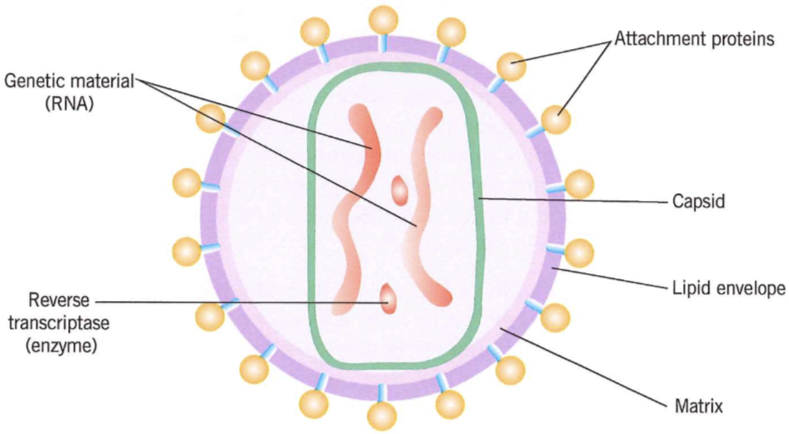
The human immunodeficiency virus (HIV) is a retrovirus. A retrovirus contains reverse transcriptase, which is able to synthesise single-stranded DNA, called cDNA, from an RNA template.

#### Replication of HIV
- HIV enters the bloodstream after infection and circulates around the body.
- Viral protein binds specifically to the CD4 protein, mainly on helper T cells.
- The viral capsid fuses with the cell membrane, releasing HIV RNA and enzymes into the host cell.
- Reverse transcriptase converts viral RNA into double‑stranded DNA.
- New viral DNA enters the nucleus and inserts into the host cell’s own DNA.
- Using host enzymes, viral DNA produces mRNA coding for new viral proteins and RNA.
- mRNA exits the nucleus and uses host cell machinery to assemble HIV particles.
- New viruses bud off from the cell surface, taking host membrane to form their lipid envelope.
![Diagram of HIV infecting a T-helper cell through the CD4 receptor, showing the virus binding, entering the cell, reverse transcriptase and RNA entering the cell, HIV RNA being transcribed into the T-cell genome, reproduction beginning, and new HIV particles budding as T-cell function diminishes. The image uses a circular step-by-step layout on a plain background with labels including T-helper cell, CD4, HIV, infection with HIV, reverse transcriptase and RNA enter the cell, HIV RNA transcribed into T-cell genome, reproduction begins, and HIV budding. The tone is educational and clinical.](../../assets/img/as-biology/as-biology-C13-img2.png)

#### HIV replication in T helper cells
1. HIV attaches to CD4 surface receptors on a TH lymphocyte and injects reverse transcriptase and RNA into the cell.
2. Reverse transcriptase uses the viral RNA as a template to make a DNA copy which gets inserted into the host chromosome.
3. The viral DNA is transcribed to make viral mRNA and translated to make viral proteins.
4. Viral proteins and RNA form new HIV particles which burst out of the host cell to infect more TH cells.
5. This destroys the T helper cell, eventually leading to dramatic reduction in the immune capability of the host.

(infected with HIV a person is said to be HIV positive)

#### How HIV causes the symptoms of AIDS
- HIV targets and destroys helper T cells, disrupting their normal function.
- Healthy blood: 800–1200 helper T cells / mm³; AIDS patients may fall below 200 cells / mm³.
- Helper T cells are vital in cell‑mediated immunity; low numbers stop activation of B cells (antibody production) and cytotoxic T cells.
- Memory cells are also infected and destroyed.
- The immune response fails, making the body vulnerable to secondary infections and cancers.
- Symptoms include lung / intestinal / brain / eye infections, weight loss and diarrhoea.
- HIV does not kill directly; failure of immunity allows opportunistic diseases to cause severe illness and death.

#### Treating HIV
- There is no cure for HIV.
- Infection is controlled using antiretroviral therapy (ART).
- Different drugs target separate stages of HIV replication and spread inside the human body.

| Type of drug | Site of action |
| --- | --- |
| Attachment and entry inhibitors | Block the attachment points for the HIV viral protein onto the helper T cell; some bind to proteins on the virus whereas others bind to receptors on the cell. |
| Reverse transcriptase inhibitors | There are two types. The non-nucleoside inhibitors act as non-competitive inhibitors, binding to reverse transcriptase at a region away from the active site. Nucleoside inhibitors act as alternative nucleotides in the synthesis of the viral DNA copy. When they are incorporated into the viral DNA copy, the polynucleotide chain is terminated. |
| Integrase inhibitors | Once reverse transcriptase has synthesised a DNA copy of the viral RNA, this copy must become part of the genomic DNA. This is called integration. Integrase inhibitors act on the enzyme responsible for this process. |
| Protease inhibitors | Inhibit the enzymes responsible for completing the modification of the proteins that are incorporated into new virus particles. |

#### Why antibiotics are ineffective against viral diseases
- Antibiotics (e.g. penicillin) kill bacteria by stopping synthesis of their murein cell walls.
- Weakened bacterial walls cannot resist osmotic water intake; cells burst and die.
- Viruses have no cell walls, no murein, and no independent metabolic pathways.
- They rely entirely on host cell machinery, so antibiotics have no target structures or processes to disrupt.
- Viruses live inside host cells, where antibiotics cannot reach them.

---

## Chapter 14 Mammalian blood - defensive mechanisms
### 14.1 Cell recognition and the cells of the immune system

Mammalian immune defence mechanisms are divided into two main categories, with specific responses mediated by **lymphocytes** (a type of white blood cell) in two forms:
- **Non-specific response**: Immediate, identical for all pathogens (e.g., physical barriers like skin, phagocytosis)
- **Specific response**: Slower, tailored to individual pathogens
  - Cell-mediated response (involves T lymphocytes)
  - Humoral response (involves B lymphocytes)

#### Key recognition molecules
Protein molecules enable the immune system to identify:
- Pathogens
- Non-self material
- Toxins produced by pathogens
- Abnormal body cells (e.g., cancer cells)

### 14.2 Phagocytosis
Phagocytosis is a core non-specific immune response that destroys pathogens via phagocytic white blood cells.

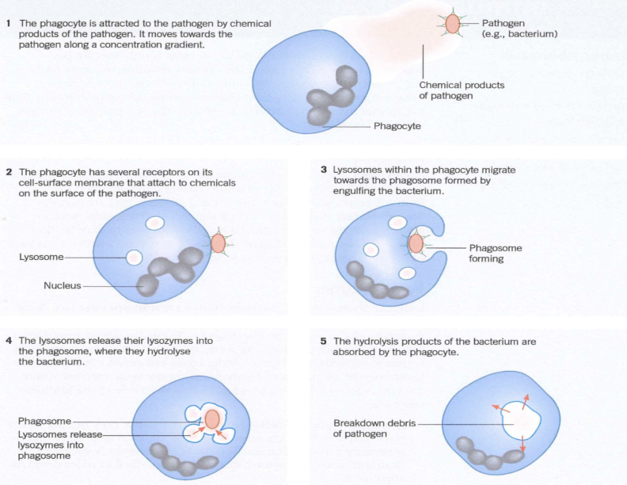

#### Phagocytosis process
1. Chemicals released by pathogens/damaged/abnormal cells **attract phagocytes** (movement along a concentration gradient).
2. Phagocytes bind to pathogen surface antigens via cell-surface receptors, then **engulf the pathogen** to form a **phagosome**.
3. Lysosomes within the phagocyte fuse with the phagosome, releasing **lysozymes** that hydrolyse the pathogen’s cell wall and destroy it.
4. Hydrolysis products of the pathogen are absorbed by the phagocyte; waste debris is eliminated.

#### Core definitions
##### Antigen
Specific cell-surface molecules (usually **proteins** on cell membranes/walls) that act as cell identifiers. The immune system distinguishes **self** and **non-self** cells by recognizing unique antigen patterns.

##### Lymphocytes
Specialized white blood cells for specific immunity, maturing in different sites:
- **B lymphocytes (B cells)**: Mature in the **bone marrow**; mediate **humoral immunity** (antibody-based).
- **T lymphocytes (T cells)**: Mature in the **thymus gland**; mediate **cell-mediated immunity** (cell-to-cell interaction).

### 14.3 Cell-mediated immune response
This response targets **pathogen-infected body cells**, abnormal cells (e.g., cancer) and transplanted cells—all classified as **antigen-presenting cells** (display foreign antigens on their surface).

#### Antigen-presenting cells (APCs)
Cells that display foreign antigens on their surface include:
- Phagocytes (after engulfing/hydrolysing pathogens)
- Infected body cells
- Transplanted cells (from the same species with different antigens)
- Cancer cells (abnormal surface antigens)

#### Cell-mediated response steps
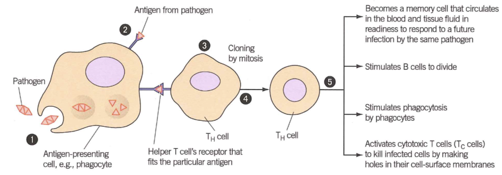
1. Pathogens invade body cells or are engulfed by phagocytes.
2. Phagocytes present pathogen antigens on their cell-surface membrane.
3. Receptors on a **specific helper T cell (TH cell)** bind to these foreign antigens, activating the helper T cell.
4. The activated helper T cell divides rapidly by **mitosis** to form a clone of T cells.

#### Functions of cloned T cells
1. Develop into **memory T cells**: Circulate in blood/tissue fluid, ready to respond rapidly to future infection by the same pathogen.
2. Stimulate B cell division and activation (links cell-mediated and humoral immunity).
3. Enhance phagocytosis (stimulate phagocytic activity).
4. Activate **cytotoxic T cells (Tc cells)** to kill infected/abnormal cells.

#### Cytotoxic T cell action
Cytotoxic T cells kill abnormal/pathogen-infected cells by producing **perforin**—a protein that forms holes in the target cell’s membrane. This makes the membrane fully permeable, causing the cell to lyse and die.
- **Key target**: Virally infected cells (destroying them stops viral replication and further spread of infection).

### 14.4B lymphocytes, humoral immunity, and antibodies
**Humoral immunity** is antibody-mediated immunity that acts in the **blood plasma and tissue fluid** (the "humors"), targeting free pathogens (not infected cells). B cells are the primary mediators, with each B cell producing antibodies specific to one antigen.

#### B cell differentiation
After activation, each B cell clone develops into two specialized cell types:
1. **Plasma cells**: Secrete large quantities of **antibodies** into blood plasma; survive only a few days. Provide the **immediate immune defence** by binding to and destroying antigens.
2. **Memory B cells**: Long-lived cells that mediate the **secondary immune response**.
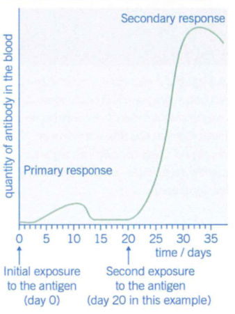

#### Humoral immune response steps

1. B cells take up surface antigens of invading pathogens via their cell-surface receptors.
2. B cells process the antigens and **present them on their own surface**.
3. Activated helper T cells bind to the processed antigens on B cells, fully activating the B cells.
4. Activated B cells divide by mitosis to form a clone of **plasma cells** (and a small number of memory B cells).
5. Cloned plasma cells produce and secrete **antigen-specific antibodies** that match the pathogen’s surface antigens.
6. Antibodies bind to pathogen antigens (**antigen-antibody complex**) and destroy the pathogen.
7. Memory B cells persist in the body; on re-encountering the same antigen, they rapidly divide into plasma cells for the secondary immune response.

#### Antibody structure

Antibodies are **globular proteins** synthesised by B cells, with a highly specific structure:
- Composed of **four polypeptide chains**: 2 heavy (long) chains and 2 light (short) chains, held together by **disulfide bridges**.
- **Variable region**: Unique to each antibody; forms the **antigen-binding site** (matches the shape of a specific antigen).
- **Constant region**: Identical for all antibodies of the same type; includes a receptor-binding site for interaction with immune cells (e.g., phagocytes).

#### Antibody action (pathogen destruction)
Antibodies do not directly kill pathogens—they mark them for destruction by two key mechanisms:
1. **Agglutination**: Antibodies bind to multiple bacterial cells, causing them to clump together. Clumped bacteria are easier for phagocytes to locate and engulf.
2. **Opsonization**: Antibodies act as **markers** on pathogen surfaces, stimulating phagocytes to recognize and engulf the attached pathogens.

### 14.5 Vaccination
**Immunity** is the ability of an organism to resist infection by disease-causing microorganisms (pathogens). Vaccination is the basis of **artificial active immunity**, inducing a specific immune response without causing the full disease.

#### Types of immunity
Immunity is classified by **how it is acquired** and **whether the body produces its own antibodies**:

| Feature                | Active Immunity                          | Passive Immunity                          |
|------------------------|------------------------------------------|-------------------------------------------|
| Antibody production    | Produced by the body itself              | Not produced by the body (external source)|
| Time to develop        | 1-2 weeks (delayed)                      | Immediate                                 |
| Memory cells           | Present (long-lasting immunity)          | Absent (temporary immunity)               |
| **Induced by:**       |                |
| Natural induction  | Exposure to a live pathogen (infection)  | Antibodies from another organism (e.g., placenta/breast milk for fetuses/infants) |
| Artificial induction| Vaccination (inactivated/attenuated pathogen/antigen) | Injected manufactured antibodies (e.g., snake bite anti-venom, monoclonal antibodies) |

##### Key details
- **Passive immunity**: No contact with pathogen/antigen required; immunity fades as external antibodies are broken down (no replacement).
- **Active immunity**: Pathogen/antigen contact required; immunity is long-lasting due to memory cells.
  - **Natural active**: From natural infection (e.g., recovering from a cold).
  - **Artificial active**: From vaccination (core of immunization programmes).

#### Features of a successful vaccination programme
To be effective, a vaccination programme must meet the following criteria:
1. Affordable and sufficient vaccine for the **most vulnerable populations** (e.g., infants, the elderly).
2. Few or no side effects (to encourage uptake).
3. Reliable vaccine production, storage and transport (maintain vaccine efficacy).
4. Proper and timely vaccine administration (correct dosage/schedule).
5. Vaccinate a high enough proportion of the population to achieve **herd immunity**.

#### Herd immunity
**Herd immunity** occurs when a **large proportion of the population is vaccinated**, creating an indirect barrier to pathogen spread.
- **Mechanism**: High vaccination rates mean susceptible (unvaccinated) individuals rarely come into contact with infected people, as the pathogen cannot spread easily through the immune population.
- **Essential for**: Individuals who cannot be vaccinated safely (e.g., babies with immature immune systems, people with compromised immune systems, those with medical contraindications).
- **Optimization**: Achieved best by **mass vaccination at the same time**, temporarily reducing disease cases and interrupting pathogen transmission (the required vaccination percentage varies by disease).

#### Why vaccination may not eliminate a disease
Despite effective vaccines, some diseases cannot be fully eliminated due to these key factors:
1. Vaccination fails to induce immunity in some individuals (primary vaccine failure).
2. Some people develop the disease **immediately after vaccination** (before immunity is fully established) and can transmit the pathogen to others.
3. Pathogens **mutate frequently**, causing **antigenic variability** (changes to surface antigens).
4. Antigenic variability (e.g., influenza virus, HIV) leads to short-lived immunity, resulting in repeated infections and the need for updated vaccines.
5. Too many pathogen varieties/strains make a **universally effective vaccine** nearly impossible (e.g., the common cold, which has hundreds of viral strains).
6. Pathogens can **hide from the immune system** (e.g., inside body cells or in immune-privileged sites).
7. Individuals object to vaccination for **religious, ethical or medical reasons** (low uptake reduces herd immunity).

#### Antigen Variability
**Antigen variability** is the change in the structure/shape of pathogen surface antigens due to **random genetic mutations**.
- Vaccines and immunity are far easier to develop for pathogens with **low/no antigen variability** (e.g., smallpox, polio) than those with high variability (e.g., flu, COVID-19).
- Mutated antigens are unrecognizable by existing memory cells, meaning the immune system mounts a slow **primary response** instead of a rapid secondary response.

#### Secondary Immune Response
The secondary immune response is the **rapid, amplified immune reaction** that occurs when the body re-encounters an antigen it has previously been exposed to (via infection or vaccination).
1. During the **primary immune response**, plasma cells secrete short-lived antibodies and produce long-lived **memory B/T cells** that circulate in the bloodstream.
2. On re-exposure to the same antigen, memory cells rapidly divide into new **plasma cells** (and more memory cells) without the need for helper T cell activation (faster pathway).
3. Plasma cells in the secondary response secrete antibodies **much faster and in larger quantities** than in the primary response, destroying the pathogen before symptoms develop.
4. New memory cells are produced to maintain **long-term immunity** against future reinfections.

#### The ethics of using vaccines
Vaccine development, testing and implementation raise important ethical questions that balance individual risk, public health and moral values:
1. Vaccine production/development often involves **animal testing**—is this ethically acceptable?
2. Vaccines may have rare side effects that cause long-term harm—how to balance this small individual risk against the greater harm of widespread disease?
3. Who should be **vaccine test subjects**? How to conduct trials ethically, and how much risk should individuals accept for public health benefit?
4. Is it ethical to test new vaccines (with unknown risks) **only in countries where the disease is common** (on the grounds that the population has the most to gain)?
5. Is **compulsory vaccination** justified for public health, especially during epidemics? On what ethical grounds can individuals opt out?
6. Is it worth continuing **costly vaccination programmes** for near-eradicated diseases, even if this reduces funding for other medical treatments?
7. How to balance **individual vaccine risks** (e.g., rare side effects) against the **population-wide benefits** of disease control and eradication?

---

## Chapter 15 Mammalian blood - the circulatory system

### 15.1 Circulatory system of a mammal
#### Mass transport
Two factors:
1. SA:V
2. How active it is?

#### Features of transport systems
1. efficient internal transport
2. transport medium
3. mass transport
4. closed tubular vessel network
5. pressure difference
   - Animals: muscular contraction
   - Plants: passive physical processes
6. maintain unidirectional flow
7. control flow to match needs of different body parts

#### Double circulatory system
- Blood passes **twice through the heart** per full body circuit
- Blood pressure reduces after passing through lungs
- Low pressure would slow circulation to body tissues
- Blood returns to heart to **boost pressure**
- Fast delivery of substances
- Suits mammals: high body temperature & **high metabolic rate**

#### Closed & Double characteristics
- **Closed**: Blood is contained in blood vessels; Always in heart, arteries, veins or capillaries
- **Double**: Blood passes through the heart twice, in one complete circuit
  1 circuit = 2 circulations:
  1) **Pulmonary circulation**: Circulation through the lungs and heart
  2) **Systemic circulation**: Circulation through other parts of the body and heart except the lungs

### 15.2 Blood vessels and their functions
#### Structure of blood vessels
- Arteries
- Arterioles: small arteries
- Capillaries: tiny vessels
- Veins

#### Common basic layers of arteries, arterioles, veins
1. Tough outer layer – resists pressure changes
2. Muscle layer – controls blood flow
3. Elastic layer – maintains blood pressure
4. Endothelium – reduces friction; thin for diffusion
5. Lumen – central cavity

#### Artery structure – function adaptations
- **Function**: transport blood **rapidly & at high pressure** from heart to tissues
- Thick muscle layer: control blood volume flow
- Thick elastic layer: maintains high pressure & smooths pressure surges
- Thick wall: resists bursting
- No valves: prevents back flow

#### Arteriole structure – function adaptations
- **Function**: **control blood flow**
- Thicker muscle layer: controls blood flow into capillaries
- Thinner elastic layer: lower blood pressure
- Thinner wall + larger lumen: adapted to lower pressure

#### Vein structure – function adaptations
- **Function**: transport blood **slowly & under low pressure**
- Thin muscle layer: no need to control blood flow
- Thin elastic layer: no stretch/recoil
- Thin wall: no bursting risk; easy to flatten
- Valves present: prevent back flow
- Muscle contraction compresses veins → pushes blood toward heart

#### Capillary structure – function adaptations
- **Function**: **exchange materials**
- Blood flow slow: more time for exchange
- Wall: short diffusion distance → rapid diffusion
- Numerous & highly branched: large **surface area**
- Narrow diameter: close to capillaries
- Very narrow lumen: reduce diffusion distance for O₂
- Gaps between endothelial cells: allow WBCs to escape for immune response

#### Formation of tissue fluid
- Blood flow creates **hydrostatic pressure** at arterial end of capillaries
- Pressure forces fluid out of blood plasma
- Opposed by:
  - Tissue fluid hydrostatic pressure
  - Blood lower water potential (plasma proteins) pulling water back
- Net outward pressure → **ultrafiltration**
- Only small molecules forced out

#### Return of tissue fluid to circulatory system
- Most fluid returns **directly to blood plasma**
- Fluid loss → capillary hydrostatic pressure **lower at venous end**
- Higher external tissue fluid pressure forces fluid back in
- Blood plasma has **lower water potential**
- Water moves back **by osmosis**

*Not all tissue fluid returns to capillaries; the rest goes through the lymphatic system.*

#### Lymph movement (no heart pump)
- hydrostatic pressure of tissue fluid
- muscle contraction squeezing lymph vessels, valves ensuring one‑way flow

### 15.3 The structure of the heart
The human heart is two separate side-by-side pumps:
- Left pump: oxygenated blood (from lungs)
- Right pump: deoxygenated blood (from body)

#### Heart chambers (2 per pump)
1. **Atrium**: Thin-walled, elastic; stretches to collect blood, pumps blood a short distance to ventricle → thin muscular wall.
2. **Ventricle**: Much thicker muscular wall; pumps blood to lungs/ rest of the body (longer distance).

#### Why two separate pumps?
- Blood passes through tiny lung capillaries → large pressure drop → slow body blood flow if sent straight to body.
- Mammal adaptation: Blood returns to heart to **increase pressure** before body distribution.
- Right ventricle: Thinner muscular wall; pumps blood to lungs
- Left ventricle: Thick muscular wall; generates sufficient pressure to pump blood
- Heart: Two separate pumps, no blood mixing after birth
- Cardiac contraction & volume: Same blood volume pumped per unit time from each ventricle; both atria contract together, then both ventricles contract together

#### Vessels connected to four chambers
- Aorta: left ventricle → oxygenated blood to body (except lungs).
- Vena cava: right atrium → deoxygenated blood from body tissues.
- Pulmonary artery: right ventricle → deoxygenated blood to lungs (O₂ replenished, CO₂ removed); carries deoxygenated blood (unusual for artery).
- Pulmonary vein: left atrium → oxygenated blood from lungs; carries oxygenated blood (unusual for vein).

#### Heart muscle oxygen supply
- Oxygenated blood in left heart does not supply heart muscle.
- Heart muscle supplied by coronary arteries (branch from aorta).
- Coronary artery blockage → myocardial infarction: heart muscle area deprived of oxygen and dies.

### 15.4 The cardiac cycle
#### Three types of valves
1. Atrioventricular valve
2. Semi-lunar valve
3. Pocket valve (in vein)

*The valves only open one way-whether they're open or closed depends on the relative pressure of the heart chambers.*

*Usually measure the pressure on the left side of heart ---Left atrium, left ventricle, aorta (Due to higher pressure and larger diff in pressure compared to right side).*

#### Three stages of the cardiac cycle
1. **Atrial systole** - Ventricles relax, atria contract
   - The ventricles are relaxed. The atria contract, decreasing the volume of the chambers and increasing the pressure inside the chambers.
   - This pushes the blood into the ventricles. There's a slight increase in ventricular pressure and chamber volume as the ventricles receive the ejected blood from the contracting atria.

2. **Ventricular systole** - Ventricles contract, atria relax
   - The atria relax. The ventricles contract (decreasing their volume), increasing their pressure.
   - The pressure becomes higher in the ventricles than the atria, which forces the AV valves shut to prevent back-flow.
   - The pressure in the ventricles is also higher than in the aorta and pulmonary artery, which forces open the SL valves and blood is forced out into these arteries.

3. **Diastole** - Ventricles relax, atria relax
   - The ventricles and the atria both relax. The higher pressure in the pulmonary artery and aorta closes the SL valves to prevent back-flow into the ventricles.
   - Blood returns to the heart and the atria fill again due to the higher pressure in the vena cava and pulmonary vein. In turn this starts to increase the pressure of the atria.
   - As the ventricles continue to relax, their pressure falls below the pressure of the atria and so the AV valves open.
   - This allows blood to flow passively (without being pushed by atrial contraction) into the ventricles from the atria. The atria contract, and the whole process begins again.

#### Key definitions
- Systole = contraction
- Diastole = relaxation
- Blood flows from higher to lower pressure
  - Contraction increases the pressure
  - Valves open/close according to pressure gradients
    - AV valves open: Pa>Pv; closed: Pa<Pv
    - semilunar valves open: Pv>Ppa; closed: Pv<Ppa

#### Cardiac output
- **Definition**: Volume of blood pumped by **one ventricle** in **one minute**
- **Unit**: dm³.min⁻¹
- **Dependent factors**:
  1. Heart rate: The rate of heart beats
  2. Stroke volume: Volume of blood pumped out per beat
- **Formula**: **Cardiac output = heart rate × stroke volume**

#### Control of the cardiac cycle
- Cardiac muscle is **myogenic**
- Key structure: **Sinoatrial node (SAN)** (in right atrium) → acts as the **pacemaker**
- **Coordination sequence**:
  1. Electrical activity wave spreads from SAN across both atria → **atrial contraction**.
  2. **Atrioventricular septum** blocks the wave from reaching ventricles directly.
  3. Electrical wave passes through the **atrioventricular node (AVN)**.
  4. AVN delays briefly, then transmits the wave to ventricles via **bundle of His**.
  5. Bundle of His conducts the wave through the septum to the **base of ventricles**, then branches into smaller fibres.
  6. Electrical wave is released from fibres → ventricles contract **simultaneously, from apex upwards**.

#### Pressure and volume changes of the heart

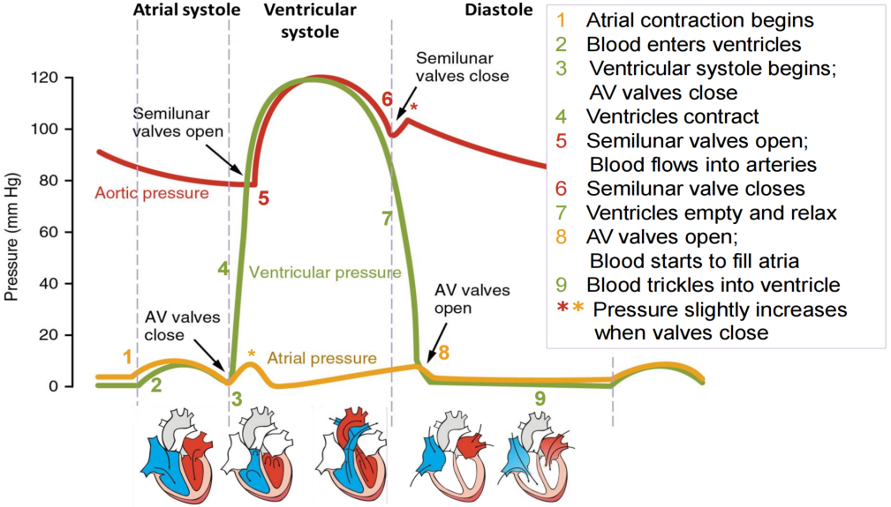

#### Pressure reference

- Systolic pressure = the maximum blood pressure in the arteries
- Diastolic pressure = the minimum blood pressure in the arteries
- Human blood pressure is usually between 80-120mmHg

### 15.5 Heart disease
#### Atheroma
- **Definition**: A fatty deposit forming within the **artery wall**
- **Development**: Starts as **fatty streaks** (accumulated white blood cells that take up LDLs) → enlarge into irregular **atheromatous plaques**
- **Plaque composition**: Mainly cholesterol, fibres, dead muscle cells
- **Location**: Most common in **larger arteries**
- **Effect**: Bulges into artery lumen → lumen narrows → **reduced blood flow**
- **Risks**: Increases chance of two dangerous conditions: **thrombosis** and **aneurysm**

#### Thrombosis
- **Cause**: Atheroma breaks through blood vessel **endothelium** → creates rough surface that disrupts smooth blood flow
- **Formation**: Rough surface leads to blood clot (**thrombus**) formation → condition is thrombosis
- **Effects**:
  1. Thrombus blocks the blood vessel → reduces/stops blood supply to tissues downstream
  2. Deprived tissues die due to lack of oxygen, glucose and other nutrients
  3. Thrombus may dislodge, travel and block another artery
- **Example**: Thrombus can form in a **coronary artery**

#### Aneurysm
- **Cause**: Atheromas (that cause thrombosis) **weaken artery walls**
- **Formation**: Weakened artery wall areas swell into a **balloon-like, blood-filled structure (aneurysm)**
- **Effect**: Aneurysms often burst → **haemorrhage** → loss of blood to the body region the artery supplies
- **Key example**: Brain aneurysm = **cerebrovascular accident (CVA) / stroke**

#### Myocardial infarction
- **Common name**: **Heart attack**
- **Definition**: Reduced oxygen supply to the heart muscle (**myocardium**)
- **Cause**: **Blockage in the coronary arteries** (almost always linked to atheroma, many cases involve coronary thrombosis)
- **Severity depends on blockage location**:
  - Near coronary artery-aorta junction: Complete blood supply cut-off → heart stops beating
  - Further along coronary artery: Milder symptoms

#### Risk factors associated with CHD
##### Smoking
###### Carbon monoxide (CO) effects
- Reacts **easily and irreversibly** with red blood cell haemoglobin → forms **carboxyhaemoglobin**
- **Direct effect**: Reduces the **oxygen-carrying capacity** of blood
- **Secondary effects**:
  1. Heart must work harder to supply adequate oxygen to tissues → raised blood pressure → increased risk of **CHD** and **strokes**
  2. Reduced oxygen transport may fail to meet heart muscle’s oxygen demand during exercise → causes **chest pain (angina)**; severe cases lead to **myocardial infarction**

###### Nicotine effects
- Stimulates adrenaline production → **increased heart rate + raised blood pressure** → higher risk of **CHD** and **strokes**
- Makes blood platelets more sticky → elevated risk of **thrombosis** → further increases chances of **strokes** or **myocardial infarction**

##### High blood pressure
- Higher arterial pressure → heart must work harder to pump blood into arteries → **increased risk of heart failure**
- Higher arterial pressure → arteries more likely to form **aneurysms and burst** → cause haemorrhage
- Arteries respond to high pressure: walls **thicken and may harden** → restrict blood flow

##### Blood cholesterol
###### High-density lipoproteins (HDLs)
- **Function**: Remove cholesterol from tissues, transport to liver for excretion
- **Effect**: Protect arteries against heart disease

###### Low-density lipoproteins (LDLs)
- **Function**: Transport cholesterol from liver to tissues (including artery walls)
- **Effect**: Infiltrate artery walls → lead to atheroma development → increase heart disease risk

##### Diet
- High salt levels → raise blood pressure
- High saturated fat levels → increase LDL levels → raise blood cholesterol concentration
- Antioxidant-rich foods (e.g., vitamin C) → reduce heart disease risk
- Non-starch polysaccharide (dietary fibre) → also reduce heart disease risk

---

## Chapter 16 Mass transport systems in plants
### 16.1 Movement of water through roots
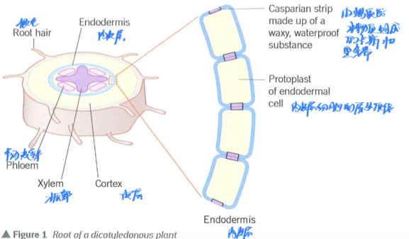
#### Root Structure & Water Absorption Basis
Most plants are terrestrial, evolving water-conserving adaptations (e.g., waterproof outer layer), so they cannot absorb water via the general body surface. Instead, they have a specialized exchange surface in soil: root hairs.

Phloem is made up of living cells that have sieve plates between them and the companion cells beside them, which provide metabolic support.
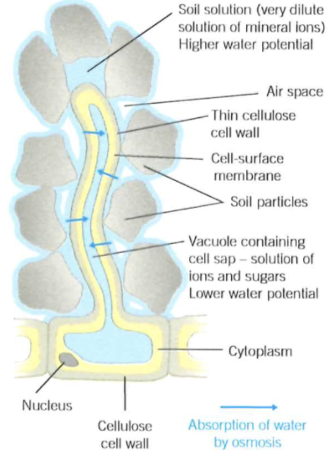

#### Uptake of water by root hairs
Root Hairs: Water & Mineral Ion Absorption
- Root hairs are plants’ exchange surfaces for absorbing water and mineral ions.
- Plants lose large amounts of water via transpiration (up to 700 dm³/day in large trees), which must be replaced by root hair absorption.
- Adaptations for efficient absorption: long extensions + thousands per root branch (large surface area); thin cell-surface membrane and cellulose cell wall (rapid material movement).
- Damp soil has a soil solution (mostly water, high water potential, slightly below zero) containing mineral ions.
- Root hair/root cells have dissolved sugars, amino acids, and mineral ions (low water potential).
- Water moves by osmosis from soil solution into root-hair cells down the water potential gradient.

#### Apoplastic Pathway
As water enters endodermal cells by osmosis, cohesive water molecules pull more water behind them, creating tension.
This tension draws water along the cell walls of root cortex cells.
The mesh-like cellulose cell walls have abundant water-filled spaces, resulting in little to no resistance to water movement.

#### Symplastic Pathway
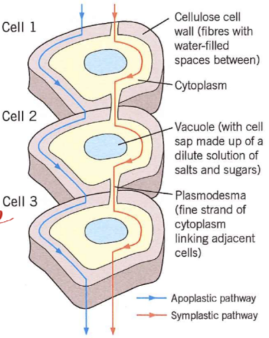
Occurs via the cytoplasm of cortex cells (osmosis-driven), with water passing through cell walls via plasmodesmata (cytoplasm-filled tiny openings).
A continuous cytoplasm column connects root-hair cells to root-centre xylem.

Water movement process:
1. Osmosis increases root-hair cell water potential.
2. Root-hair cell has higher water potential than the first cortex cell.
3. Water moves from root-hair to first cortex cell (osmosis, down water potential gradient).
4. First cortex cell has higher water potential than inner neighbour.
5. Water moves to inner neighbour (osmosis, down gradient).
6. This repeats, with water moving inward cell-by-cell.
7. Water loss from the first cortex cell lowers its potential, drawing more water from root-hair cell.
8. A water potential gradient forms across cortex cells, transporting water along cytoplasm from root-hair to endodermis.

#### Passage of water into the xylem
In the apoplastic pathway, the waterproof Casparian strip in endodermal cells blocks water movement along cell walls.
Water then enters the cell’s living protoplast and joins water from the symplastic pathway.

Endodermal cells actively transport salts into the xylem (requires energy, carrier proteins, living tissue).
This lowers xylem water potential, so water moves in by osmosis, creating root pressure that pushes water upward.
Root pressure is important in small herbaceous plants but negligible in large trees compared to transpiration pull.

**Evidence for root pressure**:
1. Root pressure increases with higher temperature and decreases at lower temperatures.
2. Metabolic inhibitors (e.g. cyanide) stop respiration and abolish root pressure.
3. Less oxygen or respiratory substrates reduces root pressure.

### 16.2 Movement of water up stems
#### Movement of Water Out Through Stomata
Atmospheric humidity (and water potential) is usually lower than that of the air spaces adjacent to stomata.
When stomata are open, water vapour diffuses out of the air spaces into the atmosphere down the water potential gradient.
Water lost from the air spaces is replenished by evaporation from the cell walls of surrounding mesophyll cells.
Plants control transpiration rate by adjusting the size of stomatal pores.

#### Movement of Water Across Leaf Cells
Mesophyll cells lose water via evaporation from cell walls to leaf air spaces.
Lost water is replaced by water from the xylem, moving through apoplastic or symplastic pathways.

**Symplastic pathway mechanism**:
1. Mesophyll cells lose water to air spaces, lowering their water potential.
2. These cells take in water by osmosis from neighboring cells.
3. Neighboring cells lose water, reducing their water potential.
4. They absorb water from their own neighbors by osmosis.

A water potential gradient is established, pulling water from the xylem across leaf mesophyll and out to the atmosphere.

#### Structure and Function of Xylem
- **Function**: Transports water (via transpiration stream) and dissolved minerals to plant tissues.
- **Structure**: Composed of dead cells forming continuous tubes.

**Water movement**:
1. Water enters root hair cells by osmosis (down water potential gradient) and moves through root tissue to xylem.
2. Leaf water evaporation creates tension, pulling water upward via cohesion (cohesion-tension theory), forming a continuous transpiration stream.

#### Movement of Water Up the Stem in the Xylem
Two key factors drive water upward from roots to leaves: cohesion-tension (main factor) and root pressure.

**Cohesion-tension theory mechanism**:
- Water evaporates from leaves via transpiration.
- Water molecules form hydrogen bonds (cohesion), sticking together.
- Water forms a continuous, unbroken column across mesophyll cells and down the xylem.
- Transpiration-driven evaporation pulls more water molecules upward via cohesion, creating transpiration pull.
- Transpiration pull puts xylem under tension (negative pressure), explaining the theory’s name.
- Transpiration pull is powerful enough to lift water 100m+ in tallest trees.

**Evidence for cohesion-tension theory**:
- Tree trunk diameter changes with transpiration rate: shrinks during the day (high tension) and expands at night (low tension).
- Broken xylem vessels allow air entry, breaking the water column—trees can no longer draw up water (cohesion fails).
- Broken xylem does not leak water (contrary to positive pressure); instead, air is drawn in, confirming tension.

#### Transpiration pull
Transpiration pull is passive and requires no metabolic energy.
Xylem vessels are dead, so their end walls break down, forming continuous, unbroken tubes from roots to leaves — essential for the cohesion-tension theory.
Energy for transpiration comes from heat, ultimately supplied by the Sun.

### 16.3 Transpiration and factors affecting it
#### Role of Transpiration
Transpiration is called a "necessary evil": unavoidable in flowering plants due to leaf adaptations for photosynthesis (large surface area for light absorption, stomata for CO₂ intake), causing huge water loss (up to 700 dm³ daily in large trees).
It is not essential for water delivery to leaves (osmosis could do this), and <1% of transported water is used by the plant.

**Benefit**: Transpiration pull carries water containing dissolved mineral ions, sugars and hormones throughout the plant, enabling rapid movement of materials.

Transpiration in xylem can be measured by using potometer.

#### Factors affecting transpiration

| Factor | How factor affects transpiration | Increase in transpiration caused by | Decrease in transpiration caused by |
|--------|----------------------------------|-------------------------------------|-------------------------------------|
| Light | Stomata open in the light and close in the dark | Higher light intensity | Lower light intensity |
| Temperature | Alters the **kinetic energy** of the water molecules and the relative humidity of the air | Higher temperatures | Lower temperatures |
| Humidity | Affects the water potential gradient between the air spaces in the leaf and the atmosphere | Lower humidity | Higher humidity |
| Air movement | Changes the water potential gradient by altering the rate at which moist air is removed from around the leaf | More air movement | Less air movement |

All factors depend on solar energy, so the Sun ultimately drives transpiration.

### 16.4 Transport of organic substances in the phloem
#### Mechanism of translocation: mass flow theory
1. Transfer of sucrose into sieve elements from photosynthesising tissue
  - Sucrose is made from photosynthesis products in chloroplast-containing cells.
  - Sucrose diffuses down a concentration gradient via facilitated diffusion into companion cells.
  - Hydrogen ions are actively transported from companion cells into cell wall spaces using ATP.
  - H⁺ diffuses back into sieve tube elements through carrier proteins.
  - Sucrose is transported with H⁺ by co-transport, using co-transport proteins.

2. Mass flow of sucrose through sieve tube elements
  - Sucrose (from source cells) is actively transported into sieve tubes, lowering their water potential.
  - Water moves from xylem into sieve tubes by osmosis, creating high hydrostatic pressure at the source.
  - At sinks (respiring/storage cells), sucrose is removed or stored, so sieve tubes lose water by osmosis, reducing pressure.
  - A hydrostatic pressure gradient exists between source and sink, causing mass flow of sucrose solution in sieve tubes.

3. Transfer of sucrose into sink cells
  - Sucrose is actively transported by companion cells out of sieve tubes into sink cells.
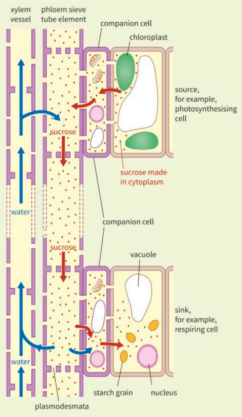

#### Evidence that translocation of organic molecules occurs in phloem
- When phloem is cut, a solution of organic molecules flows out.
- Plants given radioactive CO₂ soon show labelled carbon in phloem.
- Aphids use needle-like mouthparts to feed on phloem; sieve tube contents show sucrose changes matching leaf levels, with a short time lag.
- Ringing (removing a full circle of phloem) causes sugar accumulation above the ring and loss below.
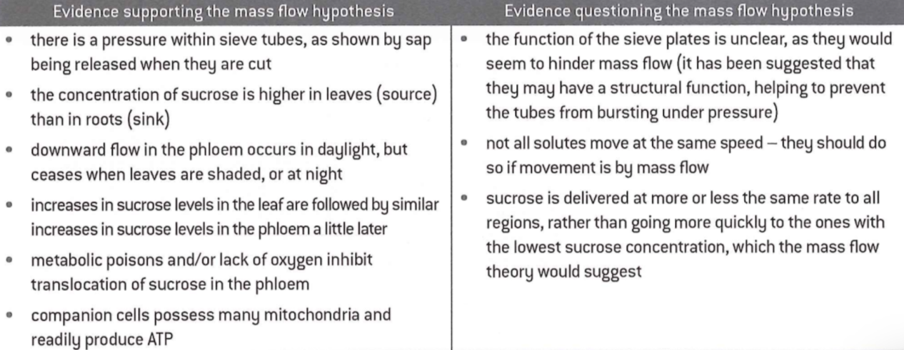

### 16.5 Investigating transport in plants
#### Ringing experiments
Woody stems have a layer of phloem cut from their circumference.
The tissue below the cut dies and the tissue above swells.
These observations suggest that removing the phloem around the stem has led to:
- Phloem sugars accumulating above the ring, causing swelling as cells take up more water by osmosis (lowered water potential from sugar buildup).
- Interrupted sugar flow below the ring, leading to tissue death in this region.

#### Tracer Experiments
Using the isotope ¹⁴C in carbon dioxide, the flow of sugars can be traced within the plant. These experiments show that sugars move around the plant only in phloem tissue.

- Radioactive isotopes (e.g. ¹⁴C) trace substance movement in plants.
- ¹⁴C is used to make ¹⁴CO₂, which is incorporated into sugars during photosynthesis.
- Radioactive sugars are tracked by autoradiography: thin stem cross-sections are placed on X-ray film.
- Film blackens where radiation from the ¹⁴C‑labelled sugars is present, corresponding exactly to phloem tissue.
- Other tissues do not blacken the film, proving only phloem translocates sugars.

### 16.6 Aphids and plant viruses
#### Aphid life cycle
- Aphids overwinter as cold-resistant eggs laid in autumn.
- Eggs hatch into wingless females, which feed and mature quickly.
- Females reproduce by parthenogenesis (asexual, no fertilisation), producing live female offspring — allowing rapid population growth.
- Some offspring develop wings, migrate to new plants, and repeat parthenogenesis.
- In autumn, winged males and sexual females are produced.
- They mate, and females lay eggs that survive winter.

#### Aphid Feeding Mechanism
Aphids feed by inserting their needle-like stylets into the phloem to withdraw sap.
Sieve tube sap is under hydrostatic pressure, causing sap to exude from the aphid’s rear.
This exudate is sticky, sugar-rich, and supports mould growth.
In heavy infestations, black moulds reduce leaf photosynthesis and lower crop yields.

**Ways aphids reduce crop yields**:
- Remove phloem sap, depriving plants of sugars and amino acids.
- Promote mould growth on leaves, reducing photosynthesis and damaging appearance.
- Transmit plant viruses.

#### Plant virus diseases
Like animal viruses, plant viruses consist of nucleic acid and a protein coat; some also have an outer membrane.
Shapes vary: tobacco mosaic virus (TMV) is rigid rods; others are spherical.
They only reproduce inside host cells but cannot penetrate cuticles or cell walls.
Entry occurs via damaged tissue or vectors (aphids, fungi, nematodes).
Viruses spread systemically throughout the plant and can be passed to the next generation via seeds and vegetative structures (e.g. tubers).

**Symptoms of Plant Viral Diseases**:
- Chlorosis (yellowing): Caused by viruses like TMV and BYDV, appearing as stripes or mosaic patterns on leaves/flowers.
- Plant part distortion: Includes leaf roll, malformed flowers/fruits (reduces crop market value and yield).
- Reduced photosynthetic efficiency (from leaf yellowing/distortion): In cereals, leads to fewer and smaller grains, lowering yield.

#### Global Importance of Plant Viral Diseases
- Plant viral infections reduce crop quality (lowering market value) and yield.
- Rice tungro virus alone causes annual losses exceeding 1.5 billion USD in Southeast Asia.
- Many viruses (e.g. BYDV) have a broad host range, infecting staple cereals.
- Viral diseases are harder to control than fungal diseases.
- A new cassava-infecting virus strain (emerged in Uganda in the late 1980s) spread to multiple African countries by 1999, causing severe yield losses—many farmers abandoned the crop, threatening regional food security.

---

## Chapter 17 Cell division
### 17.1 The cell cycle and mitosis
1. Interphase occupies most of the cell cycle (resting phase, no division). It has three stages:
    - **G₁**: proteins synthesised, new organelles formed
    - **S**: DNA replicated
    - **G₂**: organelles grow and divide, energy stores increased
2. Nuclear division: nucleus divides into two (mitosis) or four (meiosis)
3. Cell division: whole cell divides into two (mitosis) or four (meiosis)

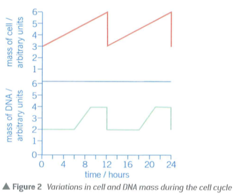

The majority of the cell cycle is spent in interphase – this is when the cell is growing and DNA is replicated.
The DNA is uncondensed and replicated so the amount of DNA doubles so each cell will have the same amount.
Organelles are also replicated so there will be enough for both new cells. The amount of ATP being produced is increased as energy is required for cell division.

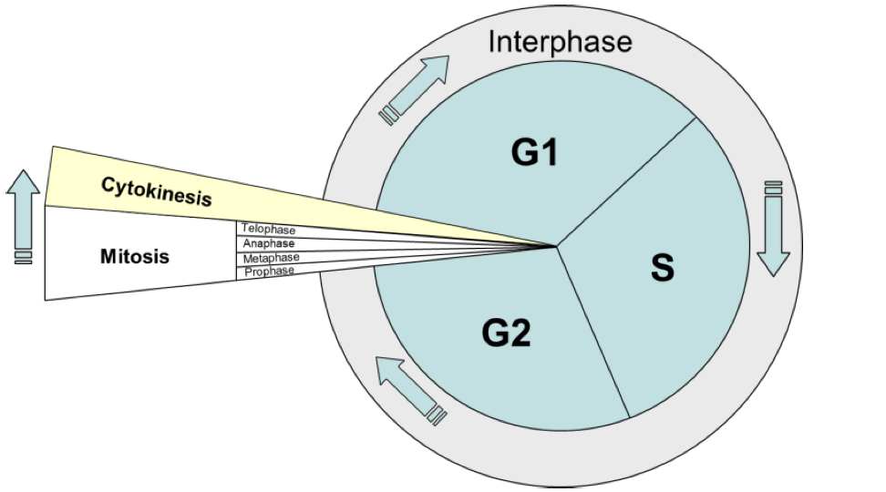

Nuclear division can take place by either mitosis or meiosis:
- **Mitosis**: produces two daughter nuclei with the same number of chromosomes as the parent cell.
- **Meiosis**: produces four daughter nuclei, each with half the number of chromosomes of the parent cell.

There are three stages to interphase:
- G1 (gap 1) phase: the cell elongates and new organelles and proteins are made
- S (synthesis) phase: the cell replicates its DNA – this is essential before the cell can divide.
- G2 (gap 2) phase: the cell keeps elongating and proteins needed for cell division are made.

#### Mitosis
1. **Prophase**
The chromosomes condense (they thicken and shorten as DNA is coiled tightly around proteins called histones) and become visible. The nucleolus disappears nuclear envelope begins to break down. The centrioles move to the poles of the cell. The centrioles (bundles of protein) begin to produce spindle fibres which start to extend towards the chromosomes
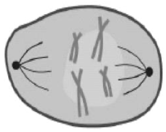

2. **Metaphase**
The nuclear membrane has disappeared. Spindle fibres have attached to the centromere or the chromosomes. Each centromere has a spindle fibre from each pole of the cell. Chromosomes are pulled to the middle/equator of the cell where they line up.
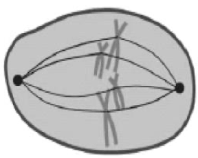

3. **Anaphase**
The spindle fibres contract. The centromere of each chromosome splits in half so that one chromatid from each chromosome can be pulled to opposite poles of the cell. This stage makes sure that each half of the cell receives one chromatid from each chromosome. This stage can be recognised by the V-shape of the chromatids as they are dragged across.
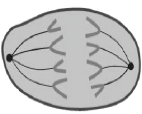

4. **Telophase**
Nuclear envelopes begin to reform around each new group of chromosomes. The spindle fibres disappear. The chromosomes begin to uncoil/unravel and become less distinct.
The cytoplasm begins to divide to form two new genetically identical daughter cells. Each new cell will have half the amount of DNA compared to the cell in interphase, until interphase begins again and DNA is replicated.
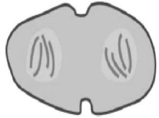

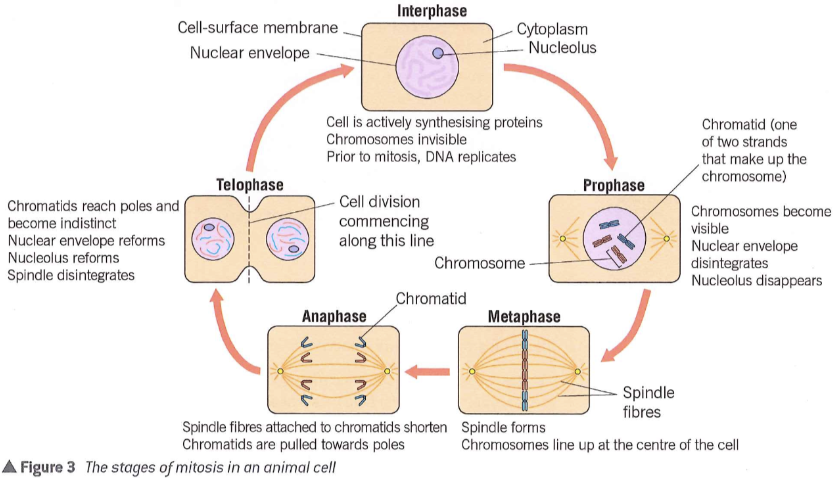

#### The importance of mitosis
1. **Growth**
When two haploid cells (sperm and ovum) fuse to form a diploid cell with full genetic information. Mitosis produces genetically identical cells for the new organism to grow and resemble parents.

2. **Differentiation**
Cells differentiate into specialised cells (e.g. epithelium, xylem). These cells divide by mitosis to form efficient tissues with identical structure and function.

3. **Repair**
Damaged or dead cells are replaced by new identical cells produced by mitosis. This maintains effective tissue function.

### 17.2 Binary fission
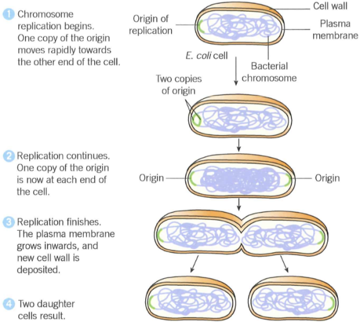
#### Binary fission VS Mitosis
Bacteria reproduce through binary fission which is a form of asexual reproduction. It is very similar to mitosis. The DNA of a prokaryotic cell is not linear and it does not condense into chromosomes because it does not associate with histone proteins, it is a single loop of circular DNA
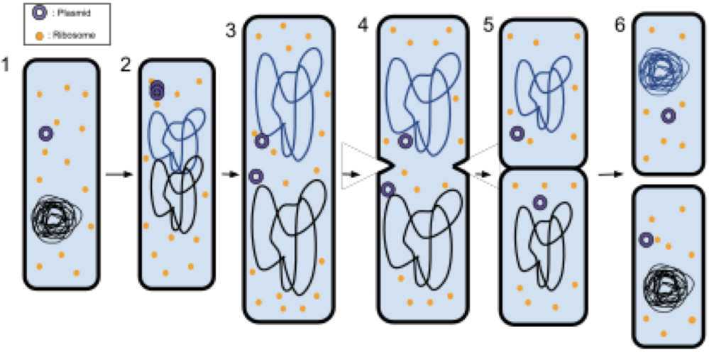
1. At the start of binary fission the DNA is replicated along with any plasmids.
2. The number of ribosomes also increases. The cell then elongates.
3. The cytoplasm divides, similar to cytokinesis in plant cells as the cell wall has to be reformed along the centre
4. The product is two new cells each with a single, identical copy of the circular DNA loop

#### Conjugation
DNA is transferred between bacterial cells.

**Process**:
- A conjugation tube forms between two cells.
- The donor cell replicates a plasmid (small circular DNA).
- The plasmid becomes linear and passes into the recipient cell.
- Only part of the donor’s DNA is transferred.

**Result**:
The recipient cell gains new characteristics from the donor.

In conjugation, DNA in the form of genes can pass between different species. This is horizontal gene transmission. When genes pass from parents to offspring of the same species, this is vertical gene transmission.

### 17.3 Gene mutation
#### Mutation
A change to the quantity or structure of DNA is called a mutation.
- Mutations in body cells are not inherited.
- Mutations in gametes may be inherited, causing sudden differences — the basis of discontinuous variation.

A change to one or more nucleotide bases or their rearrangement in DNA is a gene mutation.
DNA triplets are transcribed into mRNA and translated into a polypeptide’s amino acid sequence.
A change in DNA bases may alter the amino acid sequence.

Two types of gene mutation are base substitution and base deletion.

##### Substitution of bases
The type of gene mutation in which a nucleotide in a DNA molecule replaced by another nucleotide that has a different base.

- **A nonsense mutation**: Occurs when a base change forms a stop codon, ending the polypeptide prematurely. The protein is shortened, altered, and non-functional. Example: GTC → ATC; ATC is transcribed to UAG (a stop codon).
- **A missense mutation**: Occurs when a base change codes for a different amino acid in the polypeptide. If the amino acid is important for the protein’s tertiary structure, the protein changes shape and may not function. For enzymes, the active site may no longer fit the substrate, so catalysis fails. Example: GTC → GTG; GTG codes for histidine instead of glutamine.
- **A silent mutation**: Happens when a base substitution still codes for the same amino acid. This is due to the degenerate genetic code — most amino acids have more than one codon. There is no change to the polypeptide, so the mutation has no effect. Example: GTC → GTT; both code for glutamine.

##### Deletion of bases
A deletion mutation occurs when a nucleotide is lost from the DNA sequence.

Even one lost nucleotide can drastically change the amino acid sequence.

The genetic code is read in triplets (three bases).

One deleted base causes a frame-shift — the reading frame shifts left by one base.

All following triplets are read incorrectly, altering the whole polypeptide.

A deletion near the start affects all triplets; a deletion near the end has a smaller effect but still alters the protein.

![Diagram titled Proto-oncogenes showing a biology flowchart of how cell division is regulated. A normal pathway shows growth factor binding to a cell membrane receptor, activation of DNA replication genes, and controlled cell division. Mutated pathways show proto-oncogene changing to oncogene, receptor activation without growth factor, or excess growth factor production, leading to repeated uncontrolled division and tumour formation. Visible text includes Proto-oncogenes and labels for growth factor, receptor protein, cell division, and tumour. The setting is a clean educational diagram with a neutral scientific tone.](../../assets/img/as-biology/as-biology-C17-img11.png)

#### Causes of mutations
Gene mutations arise spontaneously during DNA replication, with no outside influence.
They are random but have a predictable rate: about 1–2 mutations per 100 000 genes per generation.
This rate is increased by mutagenic agents (mutagens), including:
- high-energy radiation, which damages DNA
- chemicals, which alter DNA structure or interfere with transcription

#### Mutations have advantages and disadvantages
- Benefits: produce genetic diversity needed for natural selection and speciation.
- Costs: often produce organisms less adapted to their environment.

Mutations in body cells can disrupt normal cell activities such as cell division.

#### Genetic control of cell division
Cell division is controlled by genes.
Normal cell division is tightly regulated by two types of genes:

##### 1) Proto-oncogenes: stimulate cell division

![Scientific biology diagram of normal cell division control on a pale background. A growth factor binds to a receptor protein at the cell-surface membrane, activating relay proteins in the cytoplasm and then a nuclear protein in the nucleus, which switches on genes needed for DNA replication. Arrows show the signaling sequence from membrane to nucleus, and DNA is shown as a double helix where replication is activated. Visible text: Cell-surface membrane, Growth factor, Receptor protein, Cytoplasm, Relay proteins, Nuclear protein switches on genes needed for DNA replication, Nucleus, DNA, Genes switched on and DNA replicates, Figure 3 Control of cell division in a normal cell. Tone is neutral and instructional.](../../assets/img/as-biology/as-biology-C17-img12.png)

**Role of proto-oncogenes**

Growth factors bind to cell membrane receptors, activating genes for DNA replication.

A mutation turns proto-oncogenes into oncogenes, which cause excessive cell division in two ways:

- Receptor protein is permanently activated even without growth factors.
- Oncogene causes excess growth factor production, over-stimulating division.

**Result**: uncontrolled rapid cell division -> tumour / cancer

- **Benign tumours**: Do not spread to other body parts. Can be easily removed and rarely reoccur.
- **Malignant tumours**: Invade nearby tissues and spread to other parts of the body. Cells grow and form secondary tumours called metastases.

##### 2) Tumour suppressor genes: slow cell division

Research into inherited cancers led to the discovery of tumour suppressor genes.

These genes inhibit cell division, the opposite of proto-oncogenes.

Normal tumour suppressor genes keep cell division normal and prevent tumours.

If mutated, they become inactivated and stop inhibiting division, so cell division increases.

Mutated cells are structurally and functionally abnormal.

Most die, but survivors can clone themselves and form tumours.

Tumours may be malignant (harmful) or benign.