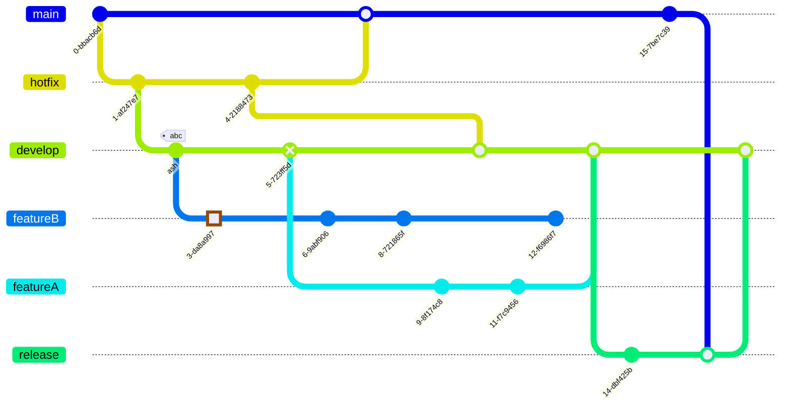
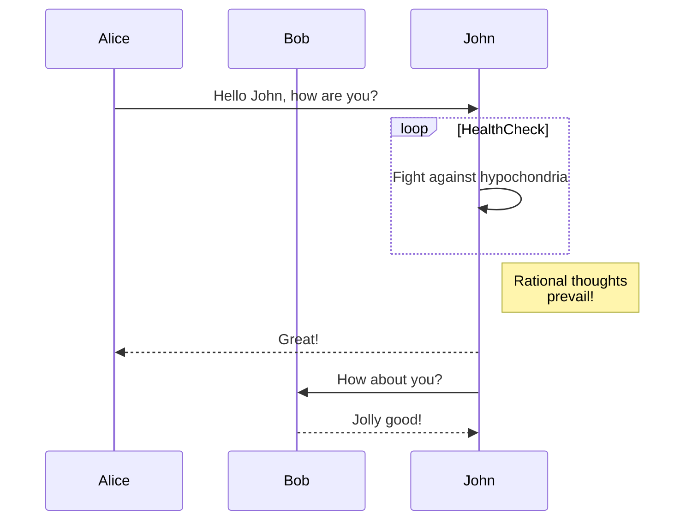
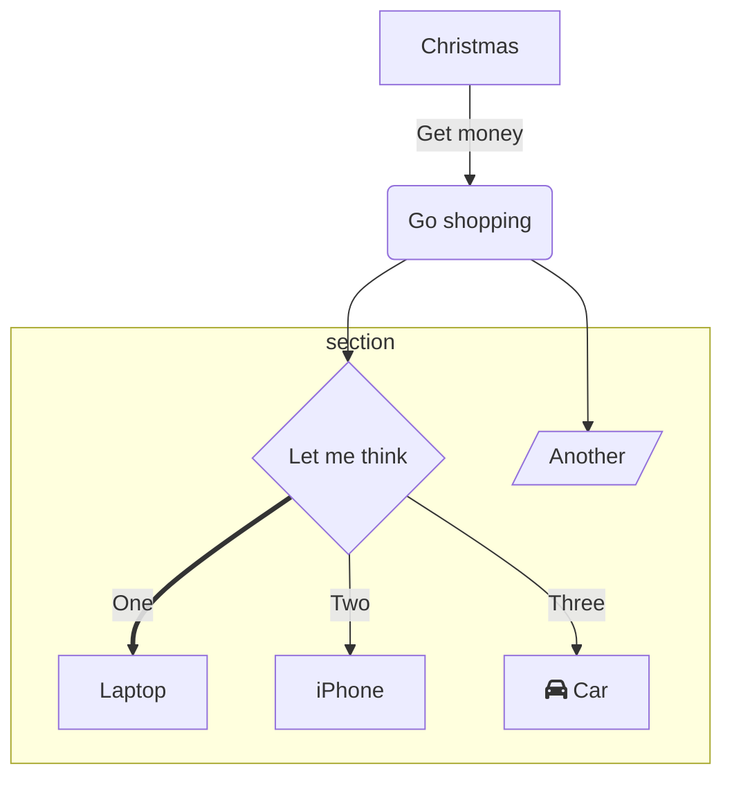

# Header 1

Lorem ipsum dolor sit amet :octocat: :squirrel:, consectetur adipiscing elit, sed do eiusmod tempor incididunt ut labore et dolore magna aliqua. Ut enim ad minim veniam, quis nostrud exercitation ullamco laboris nisi ut aliquip ex ea commodo consequat. Duis aute irure dolor in reprehenderit in voluptate velit esse cillum dolore eu fugiat nulla pariatur. Excepteur sint occaecat cupidatat non proident, sunt in culpa qui officia deserunt mollit anim id est laborum.

## Header 2

Lorem [ipsum dolor](https://www.google.com) sit amet, consectetur *adipiscing* **elit**, sed do eiusmod tempor incididunt ut labore et dolore magna aliqua. Ut enim ad minim veniam, quis nostrud exercitation ullamco laboris nisi ut aliquip ex ea commodo consequat:

- List Item One
  * List Item One
  * [List Item Two](https://en.wikipedia.org)
  * List Item Three
- List Item Two
- List Item Three

### Header 3

Duis aute irure dolor in reprehenderit in voluptate velit esse cillum dolore eu fugiat nulla pariatur. Excepteur sint occaecat cupidatat non proident, sunt in culpa qui officia deserunt mollit anim id est laborum.

1. Ordered List Item 1
  * item
2. Ordered List Item 1
3. Ordered List Item 1


$$
a^2 + b^2 = c^2  
$$

$$
x = \frac{-b \pm \sqrt{b^2 - 4ac}}{2a}  
$$

$$
d = \sqrt{(x_2 - x_1)^2 + (y_2 - y_1)^2}  
$$

$$
A = A_0 \cdot e^{kt}  
$$

$$
A = P \left(1 + \frac{r}{n}\right)^{nt}  
$$

$$
e^{i\theta} = \cos \theta + i \sin \theta  
$$

$$
c^2 = a^2 + b^2 - 2ab \cos C  
$$

$$
\sigma = \sqrt{\frac{1}{N} \sum_{i=1}^N (x_i - \mu)^2}  
$$

function: $$f(x) = 1$$

#### Header 4

When a file is created on `/dev/sda` in Linux, the process involves the kernel's `VFS` (Virtual File System) interacting with the filesystem (e.g., `ext4`) on the device. The filesystem allocates an `inode` to store metadata (e.g., permissions, ownership) and assigns data blocks for the file's content. The directory entry is updated to link the filename to the `inode`. Filesystem metadata, like free space, is also updated. All operations are handled by the kernel, ensuring data integrity. For example, `touch /mnt/sda/file.txt` triggers this process, where `/mnt/sda` is the mount point for `/dev/sda`.


```
展示展示展示
```

```c
#include<stdio.h>
void quicksort(int number[25],int first,int last){
   int i, j, pivot, temp;

   if(first<last){
      pivot=first;
      i=first;
      j=last;

      while(i<j){
         while(number[i]<=number[pivot]&&i<last)
            i++;
         while(number[j]>number[pivot])
            j--;
         if(i<j){
            temp=number[i];
            number[i]=number[j];
            number[j]=temp;
         }
      }

      temp=number[pivot];
      number[pivot]=number[j];
      number[j]=temp;
      quicksort(number,first,j-1);
      quicksort(number,j+1,last);

   }
}

int main(){
   int i, count, number[25];

   printf("How many elements are u going to enter?: ");
   scanf("%d",&count);

   printf("Enter %d elements: ", count);
   for(i=0;i<count;i++)
      scanf("%d",&number[i]);

   quicksort(number,0,count-1);

   printf("Order of Sorted elements: ");
   for(i=0;i<count;i++)
      printf(" %d",number[i]);

   return 0;
}
```

```java
public class Armstrong {
    
    public static void main(String[] args) {

        int low = 999, high = 99999;

        for(int number = low + 1; number < high; ++number) {

            if (checkArmstrong(number))
                System.out.print(number + " ");
        }
    }

    public static boolean checkArmstrong(int num) {
        int digits = 0;
        int result = 0;
        int originalNumber = num;

        // number of digits calculation
        while (originalNumber != 0) {
            originalNumber /= 10;
            ++digits;
        }

        originalNumber = num;

        // result contains sum of nth power of its digits
        while (originalNumber != 0) {
            int remainder = originalNumber % 10;
            result += Math.pow(remainder, digits);
            originalNumber /= 10;
        }

        if (result == num)
            return true;

        return false;
    }
}
```


|  1  |  1  |
| :---: | :---: |
|  2   |   2   |






